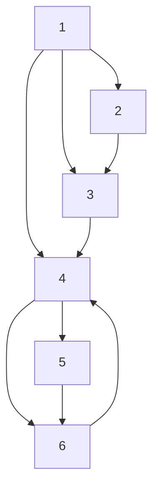
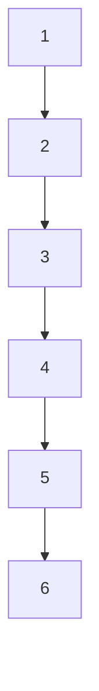

# A. The case of directed topology

The interaction topology is modeled as a directed graph ${ \tilde { \mathcal { G } } } ,$ as shown in Figure 1. The control input $u _ { i } ( t )$ adopts the

flowchart

Fig. 1. The directed graph

flowchart

Fig. 2. The undirected graph

adaptive control protocol (22). The initial states for each agent are randomly chosen from [−2, 2]. We choose $k _ { 1 } = k _ { 2 } = 1$ and $c _ { i } ( 0 ) ~ = ~ 1 , ~ i ~ = ~ 1 , . . . , 6 .$ . The revolutions of adaptive gains $c _ { i } ( t ) , ~ i ~ = ~ 1 , . . . , 6$ are shown in Figure 3, implying that $c _ { i } ( t )$ will converge to a finite positive constant. The relative states $x _ { i 1 } ( t ) - x _ { 1 1 } ( t ) , x _ { i 2 } ( t ) - x _ { 1 2 } ( t ) , i = 1 , . . . , 6$ of one sample path and the behaviors of the m.s. relative states $\begin{array} { r } { E \| x _ { i 1 } ( t ) - x _ { 1 1 } ( t ) \| ^ { 2 } , E \| x _ { i 2 } ( t ) - x _ { 1 2 } ( t ) \| ^ { 2 } , i = 1 , . . . , 6 } \end{array}$ of $1 0 ^ { 2 }$ sample paths are shown in Figure $^ { 5 , }$ indicating that a.s. and m.s. consensus can be achieved.
