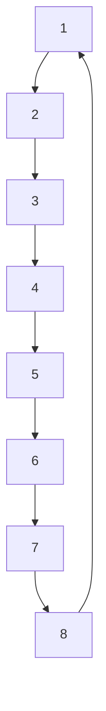

# A. Simulation Setup

Consider a group of eight oscillators whose dynamics are given by the following continuous-time linear system:

$$
\dot {x} _ {i} (t) = \left[ \begin{array}{l l} 0 & 1 \\ - 1 & 0 \end{array} \right] x _ {i} (t) + \left[ \begin{array}{l} 0 \\ 1 \end{array} \right] u _ {i} (t), \quad i \in \{1, \dots , 8 \}, \tag {50}
$$

where $x _ { i } ( t ) = [ x _ { i , 1 } ( t ) x _ { i , 2 } ( t ) ] ^ { \top } \in \mathbb { R } ^ { 2 }$ is the state vector and $u _ { i } ( t ) \in$ R is the control input. The communication graph is the cycle graph depicted in Fig. 1. We discretize (50) using

flowchart

Fig. 1. Communication graph.

line

| k | i=1 | i=2 | i=3 | i=4 | i=5 | i=6 | i=7 | i=8 |
| --- | --- | --- | --- | --- | --- | --- | --- | --- |
| 0 | 1 | 1 | 1 | 1 | 1 | 1 | 1 | 1 |
| 20 | 1 | 1 | 1 | 1 | 1 | 1 | 1 | 1 |
| 40 | 1 | 1 | 1 | 1 | 1 | 1 | 1 | 1 |
| 60 | 1 | 1 | 1 | 1 | 1 | 1 | 1 | 1 |
| 80 | 1 | 1 | 1 | 1 | 1 | 1 | 1 | 1 |
| 100 | 1 | 1 | 1 | 1 | 1 | 1 | 1 | 1 |
| 120 | 1 | 1 | 1 | 1 | 1 | 1 | 1 | 1 |
| 140 | 1 | 1 | 1 | 1 | 1 | 1 | 1 | 1 |
| 160 | 1 | 1 | 1 | 1 | 1 | 1 | 1 | 1 |
| 180 | 1 | 1 | 1 | 1 | 1 | 1 | 1 | 1 |
| 200 | 1 | 1 | 1 | 1 | 1 | 1 | 1 | 1 |

Fig. 2. Transmission instants of each agent for the proposed event-triggered method, where a value of 1 indicates that agent i transmits at that time instant, and a value of 0 otherwise.

the sampling period 0.05 and obtain the discrete-time system (1). The weighting matrices $Q , Q _ { \ell } ,$ and R are set as

$$
Q = Q _ {\ell} = \left[ \begin{array}{c c} 2 & 0 \\ 0 & 1 \end{array} \right], \quad R = 1,
$$

and $\rho = 1 . 2$ . By applying the parameter design method in Section V for $\rho = 1 . 2 { \it \Omega }$ , we obtain

$$\varepsilon = 0. 0 3 8 0, \quad \sigma = 8. 9 8 5 \times 1 0 ^ {- 6},
\Omega_ {i} = \left[ \begin{array}{c c} 0. 0 2 8 6 & 0. 0 3 7 2 \\ 0. 0 3 7 2 & 0. 0 9 6 4 \end{array} \right], \quad i \in \{1, \ldots , 8 \},
$$

and $\rho = 1 . 1 9 9 9$ , which confirms that the designed parameters satisfy the condition in Theorem 1.
