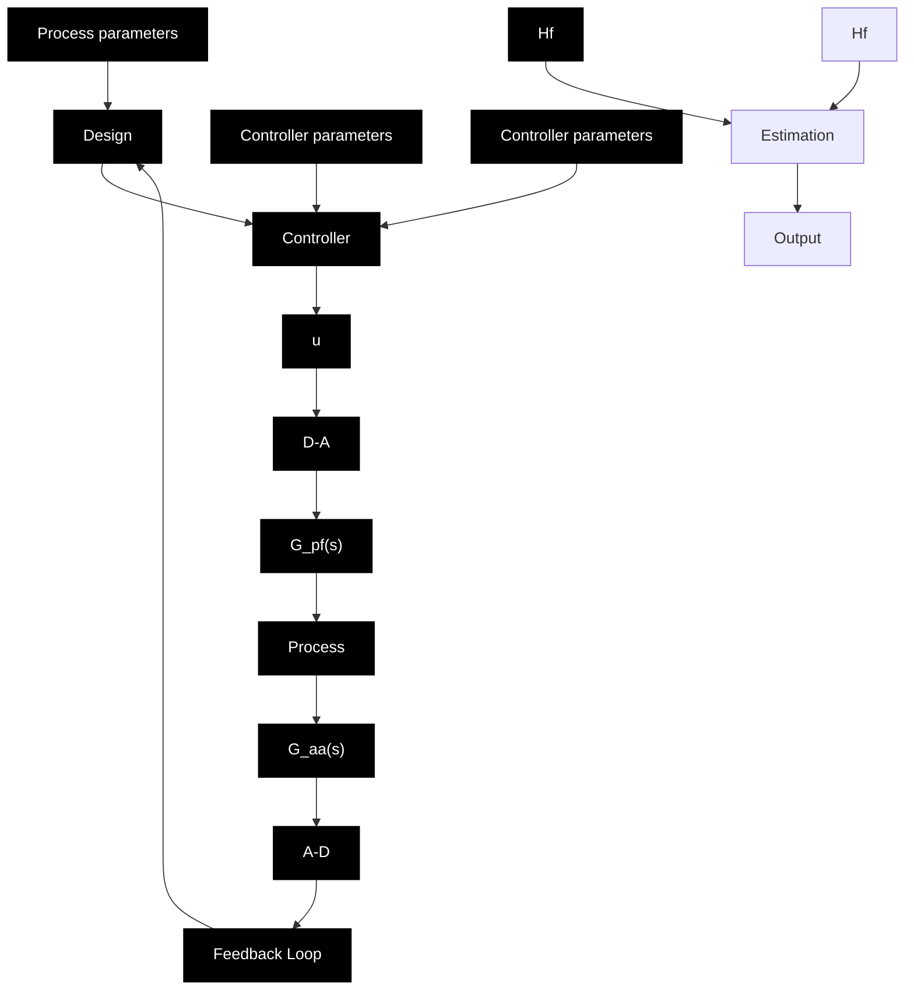

# 11.10 CONCLUSIONS

Practical aspects on implementation of adaptive controllers have been discussed in this chapter. There are many things to consider, since adaptive controllers are quite complicated devices. The following are some of the important issues:

\- Analog anti-aliasing filters must be used. They are typically second- or fourth-order filters that effectively eliminate signal components with frequencies above the Nyquist frequency $\pi / h$ , where $h$ is the sampling period.

flowchart

Figure 11.17 Block diagram of an adaptive control system with added filters. $G_{an}$ is the anti-aliasing filter, $G_{pf}$ is the postsampling filter, and $H_{f}$ is the data filter for the estimation.

The dynamics of the filters should be taken into account in the control design.
