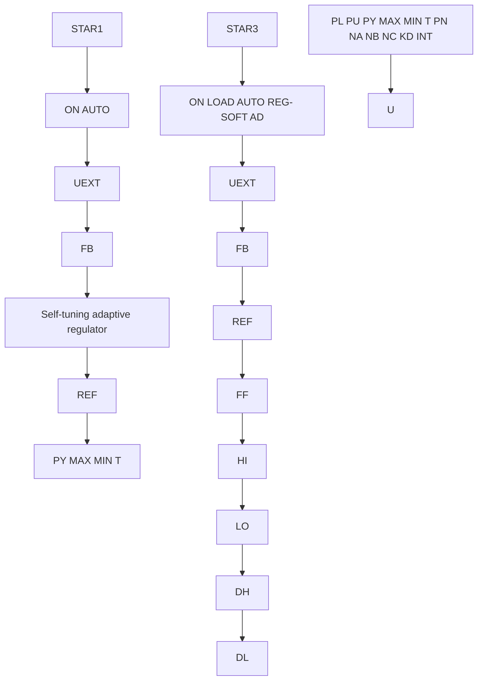

# Asea Brown Boveri (ABB) Adaptive Controller

The Asea Brown Boveri (ABB) adaptive controller was first marketed under the name Novatune. It is an adaptive controller that is incorporated as a part of ABB Master, a distributed system for process control. The system is block-oriented, which means that the process engineer creates a system by selecting and interconnecting blocks of different types. The system has blocks for conventional PID control, logic, and computation. Three different blocks, called STAR1, STAR2, and STAR3, are adaptive controllers. The adaptive controllers are self-tuning regulators based on least-squares estimation and minimum-variance control. The controllers all use the same algorithm; they differ in the controller complexity and the prior information that must be supplied in using them.

flowchart

Figure 12.3 Block diagrams of the adaptive modules STAR1 and STAR3, available in the ABB adaptive controller.

The ABB adaptive controller differs from the controllers that were discussed previously in that it is not based on the PID structure. Instead, its algorithm is based on a general pulse transfer function. It also admits dead-time compensation and feedforward control. The ABB adaptive controller system may be viewed as a toolbox for solving control problems.
