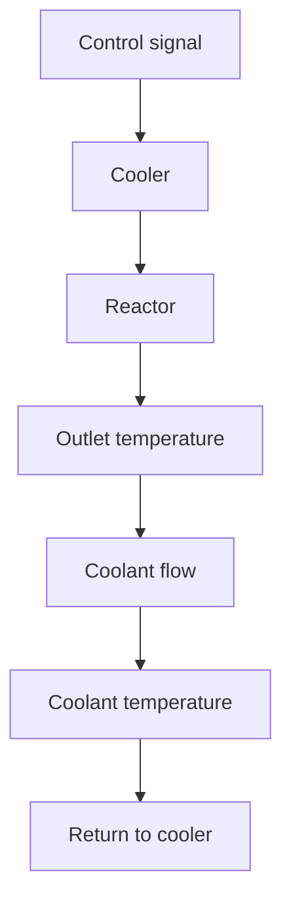

# Chemical Reactor Control

Chemical reactors are typically nonlinear. Characteristics such as catalyst activity change with time, as does the raw material. There are often inherent time delays, which may vary with production level. Poor control can result in lower product quality, damage to the catalyst, or even explosions in exothermic reactors. Chemical reactors are therefore potential candidates for adaptive control. The process in this application consists of two parallel chemical reactors in which ethylene oxide is produced by catalytic oxidation of ethylene. The process is exothermic and time-variable because of changes in catalyst activity. It is essential to keep the temperature accurately controlled; a reduction of temperature variations improves the yield and prolongs the life of the catalyst. Stable steady-state operation is also a first step toward plant optimization.

flowchart

Figure 12.7 Schematic diagram of the reactor.

The plant was equipped with a conventional control system that used PID controllers to control flow and temperature. The plant personnel were dissatisfied with the system because it was necessary to switch the controllers to manual control in case of many major disturbances, which could happen several times per day.

A schematic diagram of the process is shown in Fig. 12.7. The reactor is cooled by circulating oil to a cooler. The temperature of the coolant at the inlet to the reactor is the primary controlled variable, and the reactor outlet temperature and the coolant flow are also measured. The control signal is the flow to the cooler. The dynamics relating temperatures and flow to valve openings have variable delays and gains.
