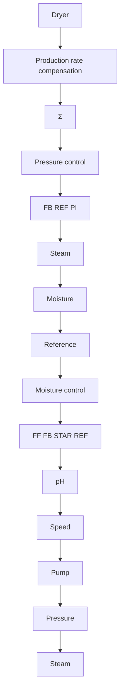

Figure 12.8 Schematic diagram of pulp drying and the control system.

The sampling period used in the adaptive controller was 3.5 minutes. A fourth-order Butterworth filter was used as an anti-aliasing filter. This was implemented by using the ABB adaptive controller tools. When the production rate was changed, large upsets were noticed, lasting for about 30 minutes, because it took 5–15 samples for the adaptive controller to settle. It was highly desirable to reduce these upsets, and this was done by introducing a special production rate compensation in the form of a pulse transfer function of the type

$$H (z) = \frac {b (z - 1)}{z - a}$$

This gives a rapid change of the steam pressure when pulp speed changes. It was not necessary to make this filter adaptive. The system has been in operation since 1983 at a pulp mill at Mörrum's Bruk that produces 330,000 tons of paper pulp per year. The operational experiences have been very good. Fluctuations in moisture content have been reduced from 1% to 0.2%, which improves quality. It also allows the setpoint to be moved closer to the target value, resulting in significant energy savings.
