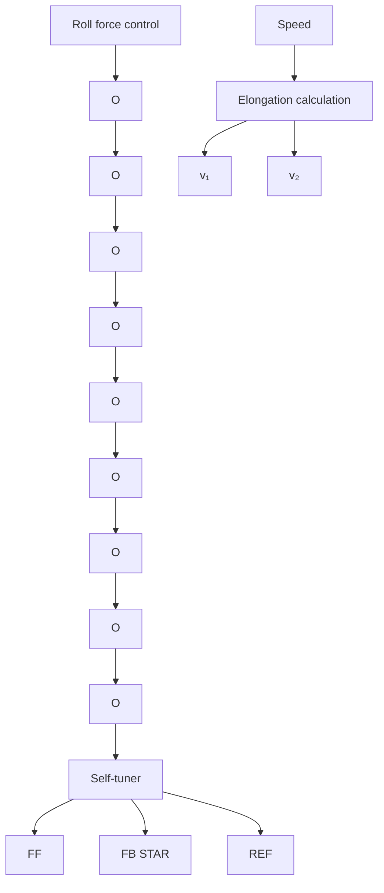

# Control of a Rolling Mill

The process control applications are typical steady-state regulation problems. The rolling mill control problem is much more batch-oriented. It illustrates the use of adaptive techniques in machine control. There are many types of rolling mills, each with its specific control problem. This particular application deals with a skin pass mill located at the end of the production line. The material processed by the mill may vary significantly in dimension and hardness.

The purpose of the mill is to influence quality variables such as hardness and yield limit. A schematic diagram of the process is shown in Fig. 12.9. Let $v_{1}$ be the speed of the strip entering the mill, and let $v_{2}$ be the speed of the strip at the exit. Because of the thickness reduction, the exit speed is larger than the entrance speed. The elongation is defined as

flowchart

Figure 12.9 Schematic diagram of the rolling mill and the control system.

$$\varepsilon = \frac {v _ {2} - v _ {1}}{v _ {1}}$$

The key control problem is to keep a constant elongation. There is a difficult measurement problem, since the velocity difference is so small. The process operates over a wide range of conditions; the following operating modes can be distinguished:

- Slow rolling at low speed during startup,   
- Acceleration to fast rolling,   
- Fast rolling at production speed,   
- Intermediate decelerations to slow rolling or even to standstill,   
- Deceleration to slow rolling at the end of the strip, and   
- System at rest waiting for the next strip.
