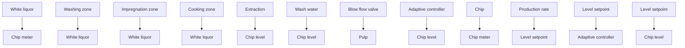

# Pulp Digester

Control of the pulp digester is an important part in manufacturing of chemical pulp. The raw material is wood chips, which are broken down into fibers by processing in a liquor composed of sodium hydroxide and sodium sulfide (white liquor). The process operates either in batches or, more commonly today, as a continuous process.

flowchart

Figure 12.12 Schematic diagram of the chip level controller for a continuous Kamyr digester.

The Kamyr digester (see Fig. 12.12) is the standard continuous process. The production rate is determined by the chip meter, which feeds chips into the top of the digester. The flow of pulp from the digester is controlled by the blow flow at the bottom. The digester has three zones: impregnation, cooking, and washing. The dynamics that describe the material transport and the chemistry in the digester is very complicated. The total residence time in the digester is about 5 hours. An important control problem is the control of the chip level, which is controlled by the blow flow. The chip level signal is calculated from three strain gauges by using a scheme developed by MoDo Chemetics. The study reported here is a feasibility study made by Pulp and Paper Research Institute of Canada (Paprican) and the pulp company MacMillan Bloedel in Vancouver. The study has resulted in an adaptive controller for digester control developed in cooperation between MoDo Chemetics in Vancouver and Paprican. The commercial adaptive controller manipulates two inputs (blow flow and chip meter) as indicated in Fig. 12.12; in the feasibility study, only the blow flow was manipulated by the adaptive controller.
