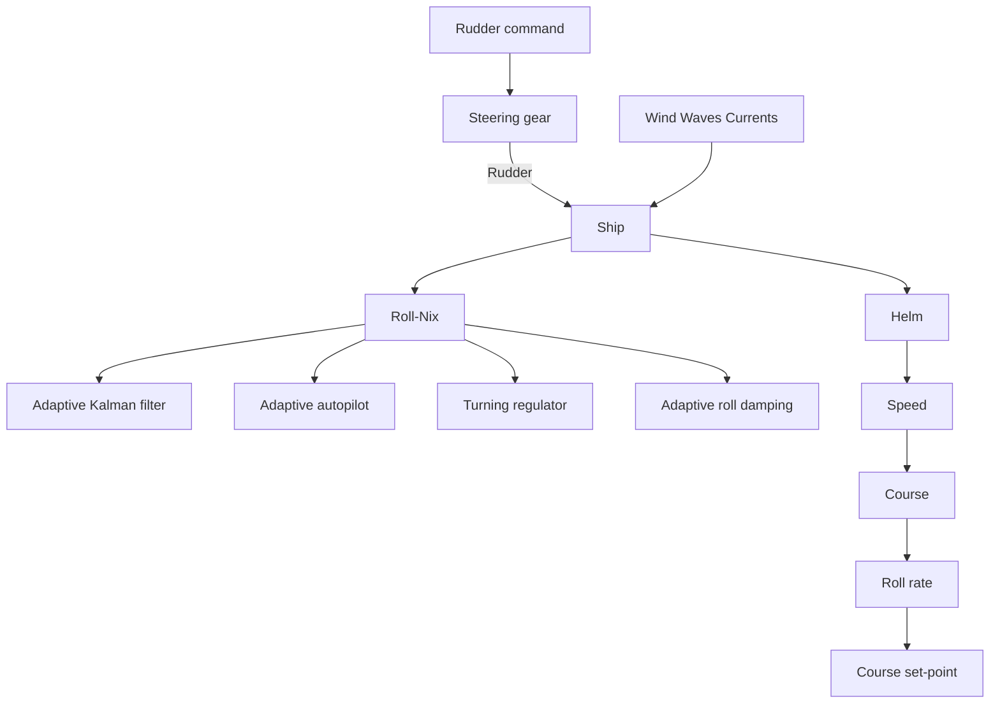

# Rudder Roll Damping System

On many ships it is desirable to reduce the rolling motion. Conventional roll damping systems on large naval ships use active fins or active as well as passive tanks. These systems are expensive to install, especially for retrofits. A third approach to roll damping is to use the rudder for roll damping as well as for maneuvering. High-frequency movements of the rudder damp the rolling without influencing the mean value of the heading of the ship. Such a system can be inexpensive, since it can easily be connected to the ordinary steering system. One such system, Roll-Nix, has been developed by SSPA Maritime Consulting in Gothenburg, Sweden. The system is also marketed by Hyde Marine Systems in Cleveland, Ohio. A block diagram of the system is shown in Fig. 12.15. Roll-Nix includes an adaptive Kalman filter, an adaptive course-keeping autopilot (optional), a high-gain turning controller (optional), and an adaptive roll damping controller. The first three parts are similar to those described for the Steermaster 2000 autopilot.

flowchart

Figure 12.15 Block diagram of the Roll-Nix roll damping system. (With courtesy of SSPA Maritime Consulting AB.)
