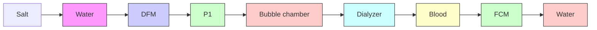

# 12.8 ULTRAFILTRATION

Patients with little or no renal function need some form of artificial blood purification to stay alive. In dialysis the blood is cleansed of waste products and excess water, and the electrolytes in the blood are normalized. More than 350,000 patients all over the world undergo this treatment a couple of times a week. In its most common form, hemodialysis, the blood flows past a semipermeable membrane with a suitably composed dialysis fluid on the other side. Because of the large number of different dialyzers that are on the market, the control algorithm in the dialysis machine must be able to handle a wide span in process gain and other process characteristics.

An adaptive pole placement controller has been used in the fluid control monitor (FCM) developed by Gambro AB in Lund, Sweden. The system has been in use for many years and it has performed very well. This is probably one of the most widely used adaptive controllers in the world today. In this section we describe the system.

flowchart

Figure 12.17 Schematic diagram of a dialysis system.
