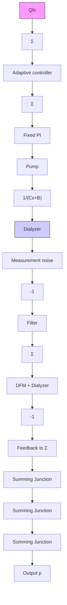

# Process Dynamics

The dialyzer dynamics can be approximately described by the model

$$C \frac {d p}{d t} = Q _ {f} - B p$$

flowchart

Figure 12.18 Block diagram of the system for controlling transmembrane pressure p and the flow difference $Q_{f}$ control system.

where p is the transmembrane pressure and $Q_{f}$ is the net fluid flow from the dialyzer. The constant C is the compliance. Parameter B, which represents the static gain, may, for example, vary from $1.6 \cdot 10^{-12}$ to $120 \cdot 10^{-12}$ ( $m^{3} s^{-1} Pa^{-1}$ ), that is, a gain variation by a factor of 75.

The complete dynamics of the pressure loop can be approximately described as a second-order transfer function. It has one pole associated with the dynamics of the ultrafiltration and another associated with the pressure control system. The PI controller is tuned conservatively so that both poles are real. The dominating time constant is 30–50 s. The transfer function from the pressure setpoint to the flow $Q_{f}$ then also has the same poles, but it also has a zero corresponding to the pole s = -B/C of the ultrafiltration (see Fig. 12.18). This zero can change significantly with the type of dialysis filter used. A consequence is that there is a drastic difference in the dynamics obtained for different filters.

The main function of the system is to control the total water removal V during the treatment. The water removal is given by

$$\frac {d V}{d t} = Q _ {f} \tag {12.5}$$
