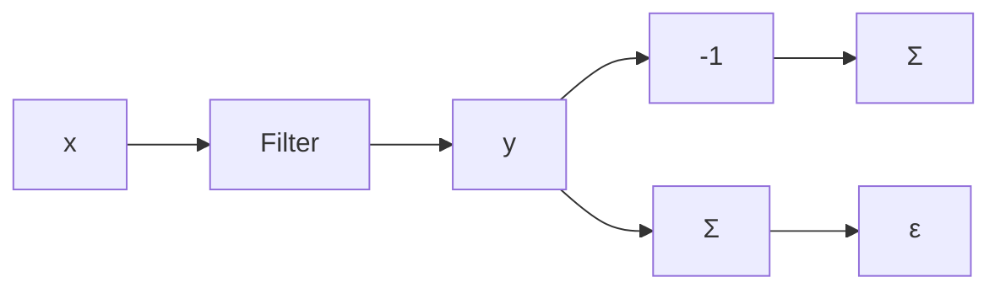
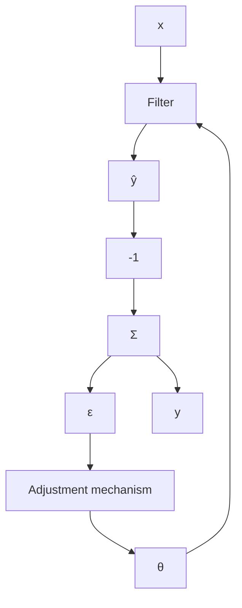
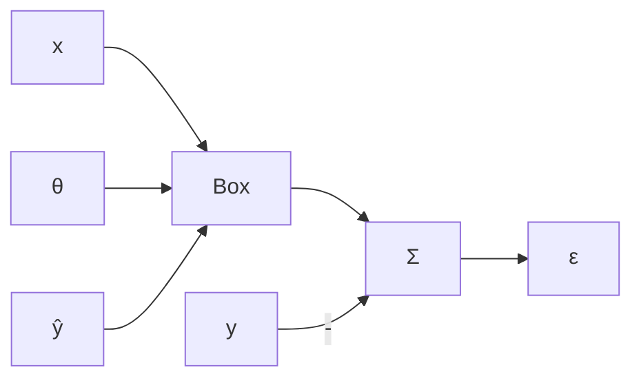

# Prediction, Filtering, and Smoothing

Prediction, filtering, and smoothing are typical signal processing problems, which can all be described as follows: Given two signals x and y and a filter F, determine the filter such that the signals y and $\hat{y} = Fx$ are as close as possible. The problem can be illustrated by the block diagram in Fig. 13.1. In a typical case we have

$$x (t) = s (t) + v (t) \quad \text { and } \quad y (t) = s (t + \tau)$$

where s is the signal of interest and v is some undesirable disturbance. The problem is called smoothing if $\tau < 0$ , filtering if $\tau = 0$ , and prediction if $\tau > 0$ . Solutions to such problems are well known for signals with known spectra and quadratic criteria. The corresponding adaptive problems are obtained when the signal properties are not known. All recursive parameter estimation methods can be applied to the adaptive signal processing problems. This is illustrated in Fig. 13.2, which gives a typical adaptive solution. The adjustment mechanism can be any recursive parameter estimator. The details depend on the structure of the filter and the particular estimation method chosen. An example illustrates the idea.

flowchart

Figure 13.1 Illustration of filtering, prediction, and smoothing.

flowchart

flowchart

Figure 13.2 (a) An adaptive system for filtering, prediction, or smoothing and (b) its simplified representation.
