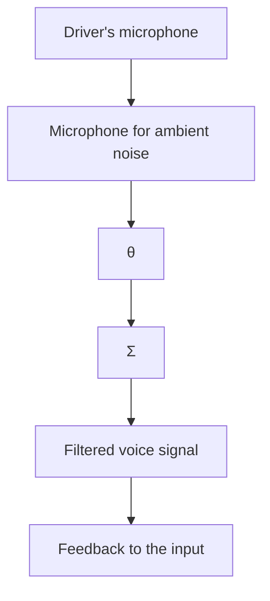

# EXAMPLE 13.1 Output error parameter estimation

Assume that the filter is represented as an ordinary pulse transfer function

$$F (z) = \frac {b _ {0} z ^ {n - 1} + b _ {1} z ^ {n - 2} + \cdots + b _ {n - 1}}{z ^ {n} + a _ {1} z ^ {n - 1} + \cdots + a _ {n}}$$

To obtain a recursive estimator, the parameter vector

$$
\theta = \left( \begin{array}{c c c c c c} a _ {1} & \dots & a _ {n} & b _ {0} & \dots & b _ {n - 1} \end{array} \right)
$$

and the regression vector

$$
\varphi (t - 1) = \left( \begin{array}{l l l l l} - \hat {y} (t - 1) & \dots & - \hat {y} (t - n) & x (t - 1) & \dots & x (t - n) \end{array} \right)
$$

are introduced. The error is then given by

$$\varepsilon (t) = y (t) - \hat {y} (t) = y (t) - \varphi^ {T} (t - 1) \hat {\theta} (t - 1)$$

and the equation for updating the estimate is

$$\hat {\theta} (t) = \hat {\theta} (t - 1) + P (t) \varphi (t - 1) \varepsilon (t)$$

The special case of Example 13.1, obtained when the filter is an FIR filter and a gradient parameter estimation scheme is used, is particularly simple. This is the LMS algorithm.

flowchart

Figure 13.3 Use of an adaptive filter for adaptive noise cancellation.
