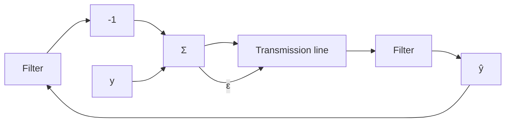

# Adaptive Differential Pulse Code Modulation (ADPCM)

Digital signal transmission is becoming important because of the rapid development of new hardware. Its use in ordinary telephone communication is increasing. Pulse code modulation (PCM) is the standard method for converting analog signals to digital form. The analog signal is filtered and digitized by using an analog-to-digital (A-D) converter. The digitized signal is then transmitted in serial form. If the A-D converter has B bits and the sampling is f Hz, the transmission rate required is fB bits/s. For standard voice signals, a sampling rate of 8 kHz is typically used. A resolution of 12 bits in the A-D converter is required to get good-quality transmission. The bit rate required is thus 96 kbit/s. By having an A-D converter with a nonlinear characteristic it is possible to reduce the bit rate to 64 kbit/s, which is the standard for digital voice transmission.

flowchart

Figure 13.4 Block diagram of a differential pulse code modulation (DPCM) system.

It is highly desirable to reduce the transmission rate, because more communication channels are then obtained with the same transmission equipment. The bit rate can be reduced significantly by using differential pulse code modulation (DPCM). In this technique the innovations of the signal are computed as $\varepsilon = y - \hat{y}$ , where $\hat{y}$ is generated by filtering the innovations through a predictive filter. Only the innovations are transmitted (see Fig. 13.4). The receiver has a prediction filter with the same characteristics as the filter in the sender. The signal $\hat{y}$ can then be reconstructed in the receiver. The bit rate that is required is reduced significantly because fewer bits are required to represent the residual. It has been shown that for voice signals, a resolution of 4 bits is sufficient. This means that the bit rate required for the transmission can be reduced from 64 kbit to 32 kbit.
