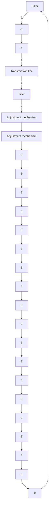

The prediction filter depends on the character of the transmitted signal. Substantial research into the characterization of speech has shown that it can be well predicted by linear filters. However, the properties of the filter will change with the particular sound that is spoken. To predict speech well, it is thus necessary to make the filters adaptive. The transmission scheme obtained is then called adaptive differential pulse code modulation (ADPCM). Such a scheme, which uses an adaptive filter based on the output error method, is shown in Fig. 13.5. Notice that the adaptive filters at the transmitter and the receiver are driven by the residual only. If the filters in the receiver and the transmitter are identical, the filter parameters will automatically be the same. The adaptive filters have therefore been standardized by CCITT (Comité Consultatif Internationale de Télégraphique et Téléphonique). The filter that is used has the transfer function

$$H (z) = \frac {b _ {0} z ^ {5} + b _ {1} z ^ {4} + \cdots + b _ {5}}{z ^ {4} (z ^ {2} + a _ {1} z + a _ {2})}$$

The regression vector associated with the output error estimation is

$$
\varphi (t) = \left( \begin{array}{l l l l} - x (t) & - x (t - 1) & e (t) & \dots & e (t - 5) \end{array} \right)
$$

flowchart

Figure 13.5 Block diagram of an adaptive differential pulse code modulation system.

and the associated parameter vector is

$$
\theta = \left( \begin{array}{l l l l l} a _ {1} & a _ {2} & b _ {0} & \dots & b _ {5} \end{array} \right)
$$

The standard least-squares estimator is of the form

$$\hat {\theta} (t + 1) = \hat {\theta} (t) + P (t + 1) \varphi (t) \varepsilon (t + 1)$$
