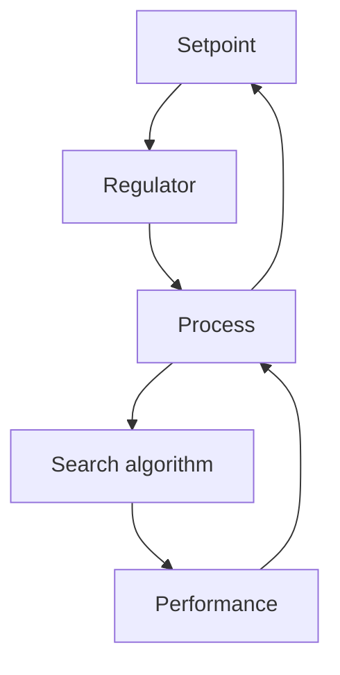

# 13.3 EXTREMUM CONTROL

The control strategies that have been discussed in the book have mainly been such that the reference value is assumed to be given. The reference value is often easily determined. It can be the desired altitude of an airplane, the desired concentration of a product, or the thickness at the output of a rolling mill. On other occasions it can be more difficult to find the suitable reference value or the best operating point of a process. For instance, the fuel consumption of a car depends, among other things, on the ignition angle. The mileage of the car can be improved by a proper adjustment, but the efficiency will depend on such conditions as the condition of the road and the load of the car. To maintain the optimal efficiency, it is necessary to change the ignition angle.

flowchart

Figure 13.6 A simplified block diagram of an extremum control system.

Tracking a varying maximum or minimum is called extremum control. The static response curve relating the inputs and the outputs in an extremum control system is nonlinear. The task of the controller is to find the optimum operating point and to track it if it is varying. Several processes have this kind of behavior. Control of the air-fuel ratio of combustion is one example. The optimum will change, for instance, with temperature and fuel quality. Another example is water turbines of the Kaplan type, in which the blade angle of the turbine is changed to give maximum output power. The same problem is encountered in wind power plants, in which pitch angle is changed depending on wind speed.
