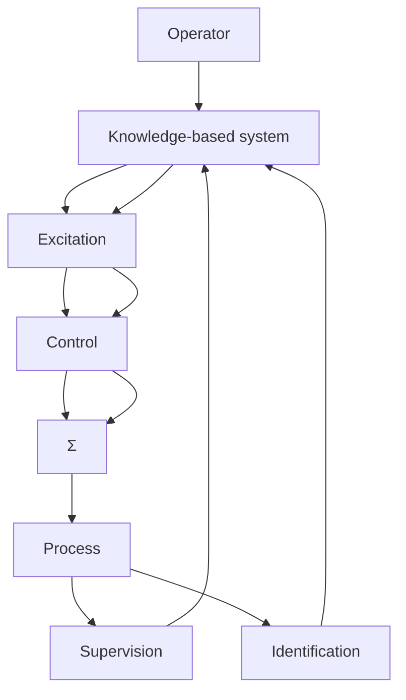

# Expert Control

The idea of expert control is to have a collection of algorithms for control, supervision, and adaptation that are orchestrated by an expert system. A block diagram of such a system is shown in Fig. 13.7. A comparison with Fig. 1.19 shows that the system is a natural extension of a self-tuning regulator. Instead of having one control algorithm and one estimation algorithm, the system has several algorithms. It also has algorithms for excitation and for diagnosis, as well as tables for storing data. Apart from this, the system also has an expert system, which decides when a particular algorithm should be used. The expert system contains knowledge about particular algorithms and the conditions under which they can be used.

In the special case in which there is only one algorithm of each category, Fig. 13.7 can be viewed as a well-structured way of implementing safety logic for an ordinary adaptive regulator. In that case the approach has the advantage that it separates the safety logic from the control algorithms. Another advantage is that the knowledge is explicit and can be investigated via the user interface.

flowchart

Figure 13.7 A knowledge-based expert control system.
