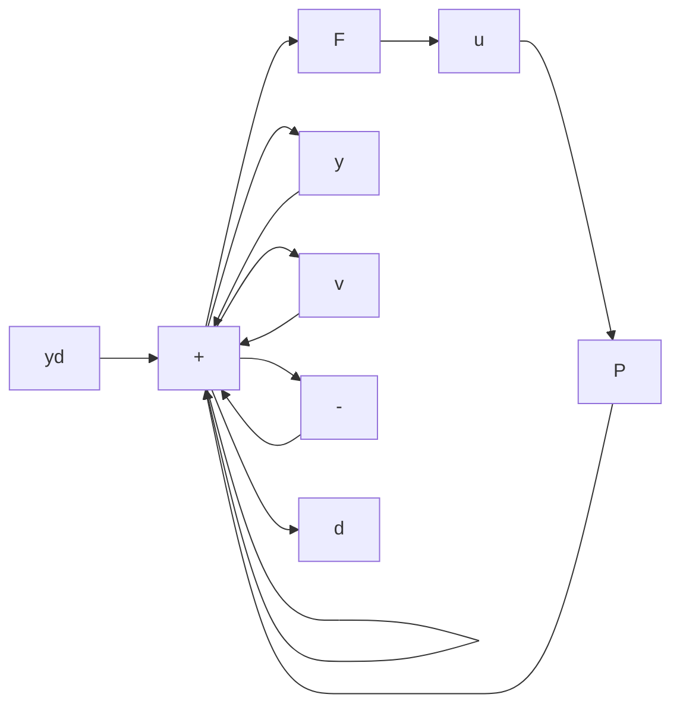

# 8.2 BASIC EXPRESSION FOR MIMO SYSTEM

The purpose of this section is to present a few basic expressions in MIMO linear systems theory.

In Figure 8.1, the signals are all vector quantities, and $F(s)$ and $P(s)$ are matrices. The dimensions are $m \times r$ for $P$ and $r \times m$ for $F$ , where $m = \dim(\mathbf{y})$

flowchart

Figure 8.1 Basic 1-DOF block diagram

and $r = \dim(\mathbf{u})$ . The most significant differences between this and the SISO case are that division becomes inversion, and the order of multiplication matters. From Figure 8.1,

$$
\begin{array}{l} \mathbf {y} = \mathbf {d} + P \mathbf {u} \\ = \mathbf {d} + P F (\mathbf {y} _ {d} - \mathbf {y} - \mathbf {v}) \\ \end{array}
$$

or

$$(I + P F) \mathbf {y} = \mathbf {d} + P F (\mathbf {y} _ {d} - \mathbf {v})\mathbf {y} = (I + P F) ^ {- 1} \mathbf {d} + (I + P F) ^ {- 1} P F (\mathbf {y} _ {d} - \mathbf {v}). \tag {8.1}$$

The sensitivity and complementary sensitivity are defined as

$$S = (I + P F) ^ {- 1} \tag {8.2}T = (I + P F) ^ {- 1} P F. \tag {8.3}$$

Both are $m \times m$ matrices. Note that

$$
\begin{array}{l} I - S = (I + P F) ^ {- 1} (I + P F) - (I + P F) ^ {- 1} \\ = (I + P F) ^ {- 1} (I + P F - I) \\ = T \\ \end{array}
$$

as in the SISO case.

Equation 8.1 is rewritten as

$$\mathbf {y} = T \mathbf {y} _ {d} + S \mathbf {d} - T \mathbf {v}. \tag {8.4}$$

We also write

$$\mathbf {e} = \mathbf {y} _ {d} - \mathbf {y} = S \mathbf {y} _ {d} - S \mathbf {d} + T \mathbf {v} \tag {8.5}$$

and

$$\mathbf {u} = F (\mathbf {y} _ {d} - \mathbf {y} - \mathbf {v}) = F S (\mathbf {y} _ {d} - \mathbf {d} - \mathbf {v}). \tag {8.6}$$

Those expressions are analogous to their SISO counterparts.
