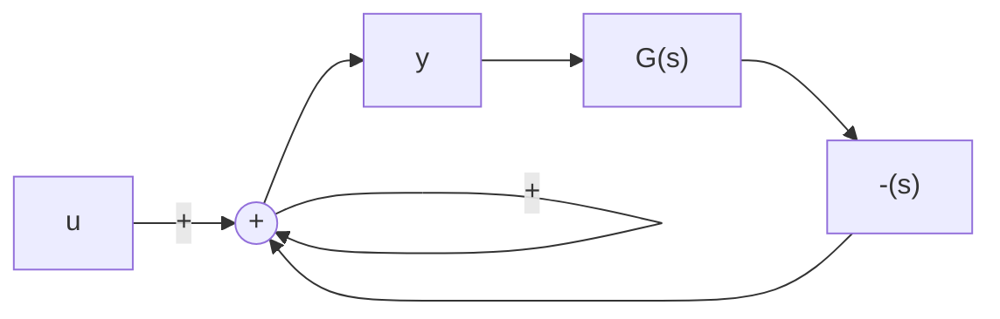

where $(A, B, C)$ is a realization of a strictly proper $G(s)$ . Then

$$
[ I - G ^ {T} (- s) G (s) ] ^ {- 1} = I + [ 0 \quad B ^ {T} ] (s I - H) ^ {- 1} \left[ \begin{array}{l} B \\ 0 \end{array} \right].
$$

flowchart

Figure 8.6 Pertaining to Lemma 8.1

Proof: In the block diagram of Figure 8.6, the sensitivity (note the positive feedback) is

$$\mathbf {y} = [ I - G ^ {T} (- s) G (s) ] ^ {- 1} \mathbf {u}. \tag {8.42}$$

Now, the realization of $G(s)$ is

$$\dot {\mathbf {x}} _ {1} = A \mathbf {x} _ {1} + B \mathbf {u}\mathbf {y} = C \mathbf {x} _ {1}$$

and the transfer function is $C(sI - A)^{-1}B$ . The transfer function $G^T(-s)$ is

$$
\begin{array}{l} G ^ {T} (- s) = [ C (- s I - A) ^ {- 1} B ] ^ {T} \\ = B ^ {T} \left[ s I - \left(- A ^ {T}\right) \right] ^ {- 1} \left(- C ^ {T}\right) \\ \end{array}
$$

which has the realization

$$\dot {\mathbf {x}} _ {2} = - A ^ {T} \mathbf {x} _ {2} - C ^ {T} \mathbf {u}\mathbf {y} = B ^ {T} \mathbf {x} _ {2}.$$

The realization for the system of Figure 8.6, concatenating the two state vectors, is

$$\dot {\mathbf {x}} _ {1} = A \mathbf {x} _ {1} + B (\mathbf {u} + B ^ {T} \mathbf {x} _ {2})\dot {\mathbf {x}} _ {2} = - A ^ {T} \mathbf {x} _ {2} - C ^ {T} (C \mathbf {x} _ {1})\mathbf {y} = \mathbf {u} + B ^ {T} \mathbf {x} _ {2}$$

or

$$
\left[ \begin{array}{l} \dot {\mathbf {x}} _ {1} \\ \dot {\mathbf {x}} _ {2} \end{array} \right] = \left[ \begin{array}{c c} A & B B ^ {T} \\ - C ^ {T} C & - A ^ {T} \end{array} \right] \left[ \begin{array}{l} \mathbf {x} _ {1} \\ \mathbf {x} _ {2} \end{array} \right] + \left[ \begin{array}{l} B \\ 0 \end{array} \right] \mathbf {u} \tag {8.43}

\mathbf {y} = \mathbf {u} + [ 0 \quad B ^ {T} ] \left[ \begin{array}{c} \mathbf {x} _ {1} \\ \mathbf {x} _ {2} \end{array} \right].
$$

The input-output relationship for this is

$$
\mathbf {y} = \left(I + [ 0 \quad B ^ {T} ] (s I - H) ^ {- 1} \left[ \begin{array}{l} B \\ 0 \end{array} \right]\right) \mathbf {u}. \tag {8.44}
$$

Comparison of Equations 8.42 and 8.44 proves the result.

Lemma 8.2

Let the system $(A, B, C)$ be stabilizable and detectable. Then, the realization equation, Equation 8.43, may not have unobservable or uncontrollable modes on the j-axis.
