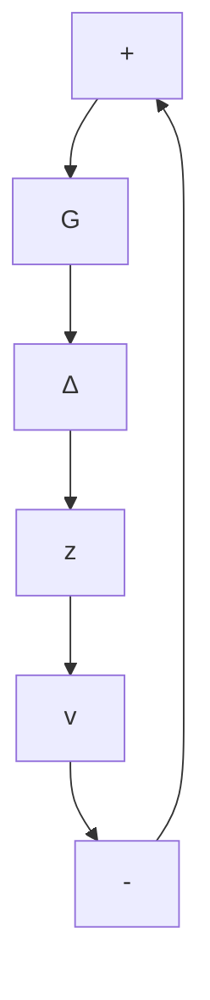

# 8.7 ROBUST STABILITY

Figure 8.7 shows a simple MIMO feedback loop consisting of a linear $m \times r$ transfer function $G(s)$ and a no-memory $r \times m$ operator $\Delta$ that, for the moment, may be nonlinear. The $\infty$ -norm of $\Delta$ is defined as

$$\| \Delta \| _ {\infty} = \sup _ {\mathbf {x} \neq 0} \frac {\| \Delta (\mathbf {x}) \| _ {2}}{\| \mathbf {x} \| _ {2}}. \tag {8.49}$$

flowchart

Figure 8.7 Feedback system used in the small-gain theorem

If $\Delta$ is linear, i.e., is a matrix, this definition comes down to the one already given. The small-gain theorem [3] asserts that sufficient conditions for stability of this loop are:

1. $G(s)$ is stable.   
2. $G(s)$ is strictly proper.   
3. $\| G\|_{\infty}\| \Delta \|_{\infty} < 1.$

Let us now specialize to the case in which $\Delta$ is a matrix, with $\overline{\sigma}(\Delta) \leq 1$ . From the small-gain theorem, the condition $\|G\|_{\infty} < 1$ is clearly sufficient to guarantee stability. We now establish that this condition is also necessary, if stability is to be maintained for all $\Delta$ of unit norm or less.

Since $G$ is stable, the number of encirclements of the origin by the locus $\det[I + G(j\omega)\Delta]$ must be zero for all admissible $\Delta$ . For $\Delta = 0$ , $\det I = 1$ for all frequencies, and there are no encirclements. The number of encirclements changes if, for some admissible $\Delta$ , the locus moves across the origin for some $\omega$ . That happens if, for some $\omega = \omega_0$ and $\Delta$ , $\| \Delta \|_{\infty} \leq 1$ , $\det[I + G(j\omega_0)\Delta] = 0$ . We show that this is always the case if $\| G \|_{\infty} \geq 1$ .

Suppose $\|G\|_{\infty}\geq1$ . Then, for some $\omega=\omega_{0}$ , $\overline{\sigma}[G(j\omega_{0})]=1$ and there exists a complex vector $v_{1}$ such that (i) $\|v_{1}\|=1$ and (ii) $v_{2}=G(j\omega_{0})v_{1}$ , $\|v_{2}\|=1$ . Pick $\Delta=v_{1}(v_{2}^{*})^{T}$ . It is not difficult to show that $\lambda_{\max}(\Delta^{*}\Delta)=1$ , so that $\overline{\sigma}(\Delta)=1$ . Now, form
