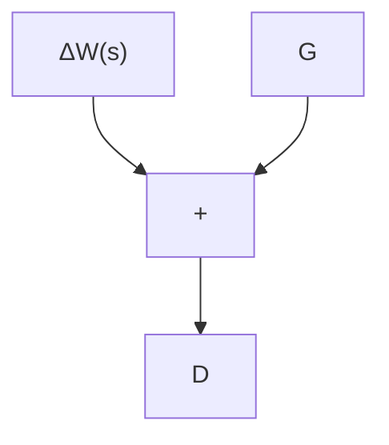

$$
\begin{array}{l} [ I + G (j \omega_ {0}) \Delta ] \mathbf {v} _ {2} = \mathbf {v} _ {2} - G (j \omega_ {0}) \mathbf {v} _ {1} (\mathbf {v} _ {2} ^ {*}) ^ {T} \mathbf {v} _ {2} \\ = \mathbf {v} _ {2} - G (j \omega_ {0}) \mathbf {v} _ {1} \\ = 0. \\ \end{array}
$$

This shows that $I + G(j\omega_0)\Delta$ is singular and that its determinant is therefore zero.

To summarize, if $\| G\|_{\infty}\geq 1$ , there always exists a $\Delta$ , $\| \Delta \|_{\infty}\leq 1$ , that will yield an unstable closed loop; if $\| G\|_{\infty} < 1$ , the loop is always stable if $G$ is stable and $\| \Delta \|_{\infty}\leq 1$ .

We may use this result to obtain sufficient conditions for robust stability in several situations. We shall represent the uncertainty as $\Delta W(s)$ , where $\Delta$ is a constant matrix such that $\| \Delta \|_{\infty} \leq 1$ ; the function $W(s)$ is used to incorporate the frequency information concerning the uncertainty.

We consider the following:

1. Multiplicative uncertainty referred to the input (Figure 8.8)   
2. Multiplicative uncertainty referred to the output (Figure 8.9)   
3. Additive uncertainty (Figure 8.10)

In each case, we reduce the diagram to that of Figure 8.7; this requires calculation of the transfer function $G(s)$ to which $\Delta$ is connected—i.e., the transfer functions from $\mathbf{v}$ to $\mathbf{z}$ , with $\Delta$ taken out.

The reader is invited to show that:

\- For the input multiplicative uncertainty,

$$G (s) = - W (I + F P) ^ {- 1} F P = - W T. \tag {8.50}$$

\- For the output multiplicative uncertainty,

$$G (s) = - W (I + P F) ^ {- 1} P F. \tag {8.51}$$

\- For the additive uncertainty,

$$G (s) = - W (I + F P) ^ {- 1} F. \tag {8-52}$$

flowchart

Figure 8.8 Illustration of a weighted input multiplicative uncertainty

flowchart

Figure 8.9 Illustration of a weighted output multiplicative uncertainty

flowchart

