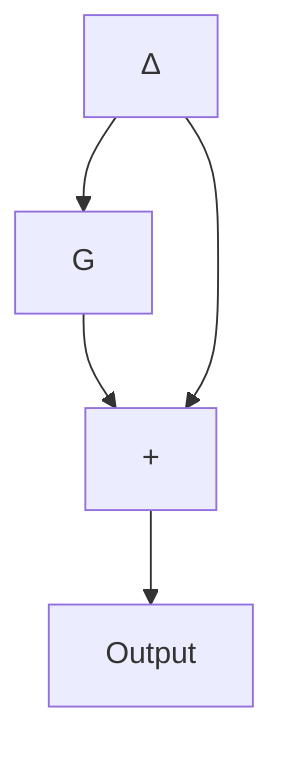
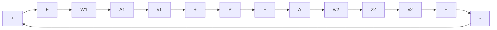

Figure 8.10 Illustration of an additive uncertainty

flowchart

Figure 8.11 A system with both multiplicative and additive uncertainties

Simultaneous perturbations are handled by using the fact that several inputs (outputs) can be gathered into one multivariable input (outputs). Consider, for instance, Figure 8.11, featuring a multiplicative input uncertainty and an additive uncertainty. It can be shown straightforwardly that

$$\mathbf {z} _ {1} = - W _ {1} (I + F D) ^ {- 1} (F P \mathbf {v} _ {1} + F \mathbf {v} _ {2})\mathbf {z} _ {2} = W _ {2} (I + F P) ^ {- 1} (\mathbf {v} _ {1} - F \mathbf {v} _ {2}).$$

Therefore, we may view the system as in Figure 8.7, where

$$
G = \left[ \begin{array}{c c} - W _ {1} (I + F P) ^ {- 1} F P & - W _ {1} (I + F P) ^ {- 1} F \\ W _ {2} (I + F P) ^ {- 1} & - W _ {2} (I + F P) ^ {- 1} F \end{array} \right]. \tag {8.53}
$$

The uncertainty block for this problem is

$$
\Delta_ {T} = \left[ \begin{array}{c c} \Delta_ {1} & 0 \\ 0 & \Delta_ {2} \end{array} \right]
$$

whose norm we need to bound.

To do this, assume $\mathbf{v}_1$ and $\mathbf{v}_2$ to be of unit Euclidean length and of dimensions equal to the numbers of columns of $\Delta_1$ and $\Delta_2$ , respectively. Given $\alpha, 0 \leq \alpha \leq 1$ , the vector $\mathbf{v}_T = [\frac{\sqrt{\alpha}}{\sqrt{1 - \alpha}} \frac{\mathbf{v}_1}{\mathbf{v}_2}]$ is of unit length. We form

$$(\mathbf {v} _ {T} ^ {*}) ^ {T} \Delta_ {T} ^ {*} \Delta_ {T} ^ {*} \mathbf {v} _ {T} = \alpha (\mathbf {v} _ {1} ^ {*}) ^ {T} \Delta_ {1} \mathbf {v} _ {1} + (1 - \alpha) (\mathbf {v} _ {2} ^ {*}) ^ {T} \Delta_ {2} ^ {*} \Delta_ {2} \mathbf {v} _ {2}. \tag {8.54}$$

Given $\| \Delta_1\|_{\infty} = \| \Delta_2\|_{\infty} = 1$ , the RHS is maximized for any $\alpha$ between 0 and 1 by choosing $\mathbf{v}_1$ and $\mathbf{v}_2$ such that

$$(\mathbf {v} _ {1} ^ {*}) ^ {T} \Delta_ {1} ^ {*} \Delta_ {2} \mathbf {v} _ {1} = (\mathbf {v} _ {2} ^ {*}) ^ {T} \Delta_ {2} ^ {*} \Delta_ {2} \mathbf {v} _ {2} = 1$$

in which case the RHS of Equation 8.54 is 1. Thus, $\| \Delta_T\|_{\infty}\leq 1$ if $\| \Delta_1\|_{\infty},$ $\| \Delta_2\|_{\infty}\leq 1.$
