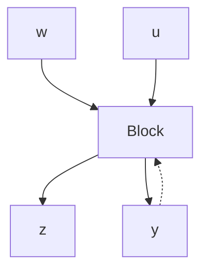

# 8.8 DEFINITION OF THE DESIGN PROBLEM

We refer to Figure 8.12, where the inputs u and w and the outputs y and z are vectors. The vector w groups exogenous signals such as disturbance, set point, or test inputs. The vector z represents performance variables that must, in some sense, be kept small; more precisely, the design objective is to keep the norm of the transmission $T_{wz}$ small. The vector u contains the control inputs, and y the measurements used for feedback purposes. It is easy to identify the vectors u and y, since they are given at the outset. The problem definition consists in the identification of the inputs w and the outputs z. Because specifications for both performance and robustness are given in terms of the weighted norms of certain transmissions, we must locate input–output pairs that have the required transmissions and form w and z from the unions of all required inputs and outputs, respectively.

flowchart

Figure 8.12 The basic design configuration
