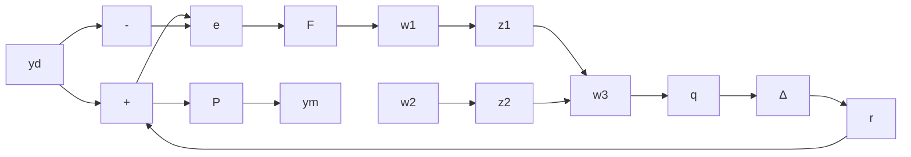
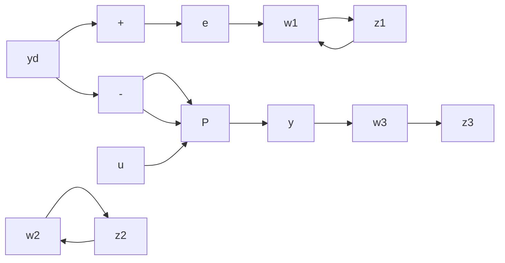

# Solution

Since S is the transmission from $y_{d}$ to e and U is the transmission from $y_{d}$ to u, the outputs $z_{1}$ and $z_{2}$ are as shown. Clearly, $z_{1} = W_{1}Sy_{d}$ and $z_{2} = W_{2}Uy_{d}$ . We could also include r among the inputs and q among the outputs; it was shown, however, that the transmission from one side of the input multiplicative uncertainty to the other is T, the complementary sensitivity. Since this is also the transmission from $y_{d}$ to $y_{m}$ , we need only run $y_{m}$ through $W_{3}$ to generate $W_{3}T$ . Thus, we define

flowchart

Figure 8.13 Setup for the solution of the design problem

flowchart

Figure 8.14 Design setup with weighting functions

$$
\mathbf {w} = \mathbf {y} _ {d}, \quad \mathbf {z} = \left[ \begin{array}{l} \mathbf {z} _ {1} \\ \mathbf {z} _ {2} \\ \mathbf {z} _ {3} \end{array} \right]
$$

as shown in Figure 8.14.

The solution algorithms will minimize or bound $\|T_{wz}\|_{k}$ , with k = 2 or $\infty$ . In the preceding example,

$$
\| T _ {\mathbf {w z}} \| = \| \left[ \begin{array}{c} W _ {1} S \\ W _ {2} U \\ W _ {3} T \end{array} \right] \|.
$$

The quantities of interest are $\|W_{1}S\|$ , $\|W_{2}U\|$ , and $\|W_{3}T\|$ ; we must therefore know how these quantities are related to $\|T_{wz}\|$ . To proceed, we need the following result.

■ Theorem 8.2 Let $T(s)$ be decomposed into an $n \times m$ array of submatrices $T_{ij}(s)$ . Then

$$\max _ {i j} [ \| T _ {i j} \| _ {2} ] \leq \| T \| _ {2} \leq \sqrt {m n} \max _ {i j} [ \| T _ {i j} \| _ {2} ]. \tag {8.55}$$

The same result holds for the $\infty$ -norm.

Proof: For the 2-norm, it is easy to show that

$$\operatorname{tr} T ^ {*} T = \sum_ {i j} \operatorname{tr} T _ {i j} ^ {*} T _ {i j}.$$

Since all the terms in the same are positive,

$$\operatorname{tr} T ^ {*} T \geq \max _ {i j} [ \operatorname{tr} T _ {i j} ^ {*} T _ {i j} ].$$

Also,

$$\operatorname{tr} T ^ {*} T \leq n m \max _ {i j} [ \operatorname{tr} T _ {i j} ^ {*} T _ {i j} ]$$
