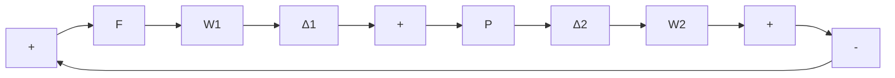

# Problems

M 8.1 For the system

$$
H (s) = \left[ \begin{array}{c c} \frac {1}{(s + 1) ^ {2}} & \frac {1}{(s + 1) (s + 2)} \\ \frac {- 1}{(s + 2)} & \frac {2}{(s + 2) ^ {2}} \end{array} \right]
$$

a. Compute the singular values, and plot them versus frequency.   
b. A controller F = kI is used to control the plant in a 1-DOF feedback configuration. Show the Nyquist plots of $\det[I + L(s)] - 1$ , where $L(s)$ is the loop gain, for k = 0.1, 1, 10, and 100. Assess the closed-loop stability for each value of k. (You may use Bode plots instead.)   
c. For stabilizing values of k, compute the singular values of $S(j\omega)$ . Relate the results to those of part (b).

M 8.2 Repeat Problem 8.1 for

$$
H (s) = \left[ \begin{array}{c c} \frac {1}{s + 3} & \frac {- (s + 1)}{(s + 2) ^ {2}} \\ \frac {1}{s + 1} & \frac {2}{s ^ {2} + s + 2} \end{array} \right].
$$

8.3 Drum speed control Repeat Problem 8.1 for the drum-speed-control problem, using the transfer functions derived in Problem 3.15 (Chapter 3). The inputs are $u_{1}$ and $u_{2}$ , and the output is $\omega_0$ . Use the gain values $k = 1, 100$ , and 1000.   
8.4 Blending tank Repeat Problem 8.1 for the blending-tank problem, using the transfer functions derived in Problem 3.17 (Chapter 3). The inputs are $\Delta F_A$ and $\Delta F_0$ , and the outputs are $\Delta \ell$ and $\Delta c_A$ . Use the gain values $k = 0.1$ , 1, and 10.   
8.5 Chemical reactor Repeat Problem 8.1 for the chemical reactor problem, using the transfer functions derived in Problem 3.19 (Chapter 3). Use $\Delta Q$ and $\Delta F$ as inputs and $\Delta c_A$ and $\Delta T$ as outputs. Use the gain values $k = 10^3$ , $10^4$ , and $10^5$ .   
M 8.6 For the system of Problem 8.1:

a. Calculate the norm $\| H\| _2$ using the Parseval integral.

b. From the plots of singular values, obtain $\|H\|_{\infty}$ .

M 8.7 Repeat Problem 8.6 for the system of Problem 8.2.

8.8 For the system

$$
\dot {x} = \left[ \begin{array}{c c} 0 & 1 \\ - 1 & - 1 \end{array} \right] x + \left[ \begin{array}{c} 1 \\ - 1 \end{array} \right] u
y = x
$$

flowchart

Figure 8.21 System with two uncertainties

