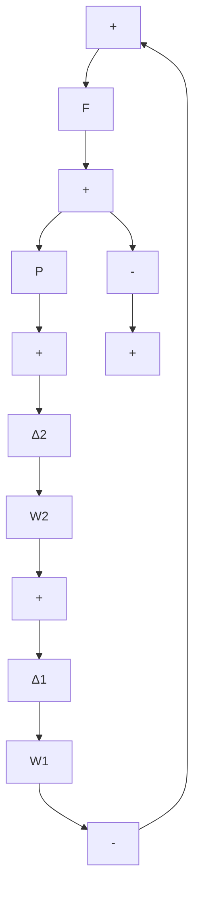

flowchart

Figure 8.22 System with two uncertainties

a. Calculate the 2-norm, using the method based on the Lyapunov equation.
b. Calculate the $\infty$ -norm by hand.

8.9 Repeat Problem 8.8 for the system

$$
\begin{array}{l} \dot {x} = \left[ \begin{array}{c c} - 1 & 1 \\ - 1 & - 1 \end{array} \right] \mathbf {x} + \left[ \begin{array}{c} 0 \\ 1 \end{array} \right] u \\ y = x. \\ \end{array}
$$

8.10 Figure 8.21 shows a closed-loop system with two uncertainty branches. Give the necessary and sufficient conditions for stability for:

a. $\| \Delta_1\|_{\infty} < 1, \Delta_2 = 0$   
b. $\Delta_1 = 0, \| \Delta_2 \|_{\infty} \leq 1$   
c. $\| \Delta_1\|_{\infty}\leq 1,\| \Delta_2\|_{\infty}\leq 1$

(Note that these blocks are MIMO.)

8.11 Repeat Problem 8.10 for the system of Figure 8.22.   
8.12 We wish to use $H^2$ and $H^\infty$ techniques to design a 1-DOF, SISO control system for the plant $P(s) = (-1) / (s^2 - 1)$ . The specifications are as follows:

$$\| W _ {1} S \| _ {\infty} \leq 1, \quad \| W _ {2} T \| _ {\infty} \leq 1, \quad \| \frac {u}{y _ {d}} \| _ {\infty} \leq 1 0$$

where $W_{1}(s) = 10 / (s + 1)$ and $W_{2}(s) = .1(s + 4)$ .

a. Obtain realizations for all transfer functions. (You will need to combine $W_{2}$ with another, strictly-proper block as in Example 8.8.)   
b. Set up the state-space description in terms of control and disturbance inputs and measured and performance outputs.   
c. Verify that the technical conditions for the $H^2$ and $H^\infty$ solutions are satisfied; if they are not, add small noise inputs as required.   
d. Compute the $H^{2}$ solution.   
e. Compute a set of $H^{\infty}$ solutions. For each one, calculate the $\infty$ -norms of the transfer functions whose norms must be bounded. Adjust the weights on the performance outputs until the specifications are met.

8.13 Repeat Problem 8.12 with $P(s) = (-s + 1) / (s^2 + s + 1)$ , all other data remaining the same.

