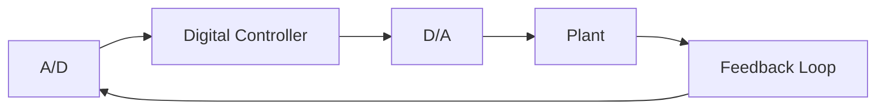

# 9.1 INTRODUCTION

In the great majority of cases, the implementation of control systems is done on computers. Typically, a design is carried out in the analog domain and “ported” into a digital implementation. This introduces two effects: sampling and quantization.

Sampling is the more important of the two and will occupy most of this chapter. It is made necessary by the fact that a digital computer requires a nonzero time interval to perform the calculations required for one time point of the system output. It follows that, to function in real time, the computer cannot do a control calculation for all time instants—hence the name “sampled-data systems.” We shall assume that those sampling instants are uniformly spaced in time. This is not technologically necessary, but nonuniform sampling introduces major theoretical complications.

Quantization takes place because digital computers operate with finite arithmetic. When a system output is sampled, it is converted by roundoff or truncation to a binary value with a finite number of bits. Given the accuracy of modern digital equipment, quantization is important only in cases where extremely high accuracies are involved. We shall not treat quantization effects in this chapter; the reader is referred to Moroney [1] and Oppenheim [2] for discussions of the subject.

Figure 9.1 shows a component block diagram of a sampled-data system for a single-input, single-output (SISO) system. The analog-to-digital (A/D) block samples the system output at constant rate and gives the computer a string of digital signals. The computer performs the control calculations.

flowchart

Figure 9.1 Component diagram of a sampled-data system
