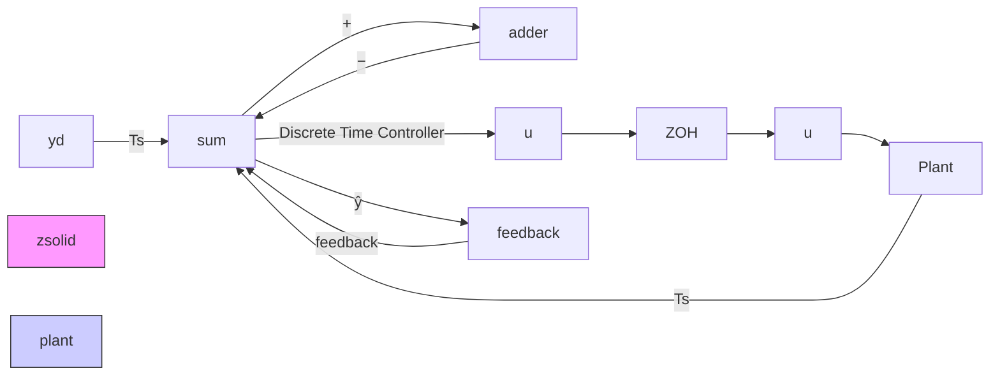

# 9.5 SAMPLED-DATA SYSTEMS

The object of this section is to obtain the discrete-time representation of a sampled-data system using a zero-order hold to generate the plant input, as shown in Figure 9.9. We need to do this in order to construct a control system entirely out of discrete-time blocks. The controller, as a difference-equation algorithm, is in discrete time, so the part of the system that includes the ZOH, the plant, and the output sampler must be discretized. The starting point may be the transfer function of the continuous-time plant or a state representation. We begin with the latter.

flowchart

Figure 9.9 Illustration of a sampled-data system

Let

$$\dot {\mathbf {x}} = A \mathbf {x} + B \mathbf {u}\mathbf {y} = C \mathbf {x} + D \mathbf {u}.$$

With $\mathbf{u}(t) = \widehat{\mathbf{u}}(k)$ , $kT_{s} \leq t < (k + 1)T_{s}$ , we may write

$$\mathbf {x} (k T _ {s} + T _ {s}) = e ^ {A T _ {s}} \mathbf {x} (k T _ {s}) + \int_ {k T _ {s}} ^ {k T _ {s} + T _ {s}} e ^ {A (k T _ {s} + T _ {s} - \tau} B \mathbf {u} (\tau) d \tau . \tag {9.30}$$

Since $\mathbf{u}(\tau) = \widehat{\mathbf{u}}(k)$ over the interval of integration,

$$\int_ {k T _ {s}} ^ {k T _ {s} + T _ {s}} e ^ {A (k T _ {s} + T _ {s} - \tau)} B \mathbf {u} (\tau) d \tau = \left[ \int_ {0} ^ {T _ {s}} e ^ {A (T _ {s} - \tau^ {\prime})} B d \tau^ {\prime} \right] \widehat {\mathbf {u}} (k)$$

where we have used the substitution $\tau' = \tau - kT_s$ .

With $\mathbf{x}(kT_s) = \widehat{\mathbf{x}}(k)$ , Equation 9.30 becomes

$$\widehat {\mathbf {x}} (k + 1) = \mathcal {A} \widehat {\mathbf {x}} (k) + \mathcal {B} \widehat {\mathbf {u}} (k)\widehat {\mathbf {y}} (k) = \mathcal {C} \widehat {\mathbf {x}} (k) + \mathcal {D} \widehat {\mathbf {u}} (k) \tag {9.31}$$

where

$$\mathcal {A} = e ^ {A T _ {s}}\mathcal {B} = \int_ {0} ^ {T _ {s}} e ^ {A (T _ {s} - \tau)} B d \tau .$$

These matrices are easily computed (MATLAB c2d).
