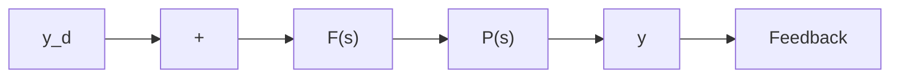
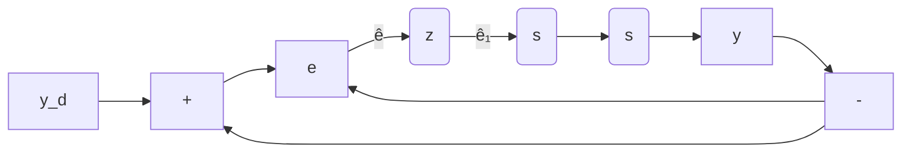

# 9.7.1 The Case of Small Sampling Period

To consider the digital implementation of a continuous-time design, we begin with the continuous-time design of Figure 9.13a, to be approximated by the system of

flowchart

Figure 9.13a The continuous-time design to be approximated

flowchart

Figure 9.13b The sampled data approximation of the continuous-time design

Figure 9.13b. For simplicity, let us assume that Fourier transforms exist when they are used.

From Equation 9.6,

$$\widehat {e} (j \omega) = \frac {1}{T _ {s}} \sum_ {k = - \infty} ^ {\infty} e (j \omega - j k \omega_ {0}), \quad \omega_ {0} = \frac {2 \pi}{T _ {s}}.$$

The transmission in continuous time of the pulse transfer function $F(z)$ is $F(e^{j\omega T_{s}})$ . To see this, recall that the pulse transfer function was developed by replacing $e^{sT_{s}}$ with z.

There remains the transmission of the ZOH, given in Equation 9.8 as

$$G _ {Z O H} = 2 \sin \left(\frac {\omega T _ {s}}{2}\right) \frac {e ^ {- j (\omega T _ {s} / 2)}}{\omega}$$

and, of course, that of the plant $P(j\omega)$ . The result is

$$y (j \omega) = F (e ^ {j \omega T _ {s}}) G _ {Z O H} (j \omega) P (j \omega) \frac {1}{T _ {s}} \sum_ {k = - \infty} ^ {\infty} \mathbf {e} \left(j \omega - j k \frac {2 \pi}{T _ {s}}\right). \tag {9.32}$$

Note that $F(e^{j\omega T_{s}})$ is a periodic function of $\omega$ , with a period of $2\pi/T_{s}$ , the same as that of $e(j\omega)$ . Figure 9.14 shows the components of the right-hand side (RHS) of Equation 9.32 under the following conditions:

1. $|e(j\omega)|$ is band-limited.   
2. $T_{s}$ is small enough that the aliases of $e$ do not overlap.   
3. $|P(j\omega)|$ goes to zero as $\omega \to \infty$ .

We pose the following question: Under what circumstances is the transmission from $y_{d}(t)$ to $y(t)$ approximately the same as in continuous time?

Reasoning from Figure 9.14, we note the following:
