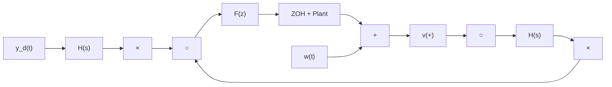

1. The signal e must be band-limited to half the sampling frequency so that the aliases do not overlap.   
2. The open-loop transmission must be low-pass so as to attenuate all aliases save the central one around zero frequency.   
3. $F(e^{j\omega T_{s}})$ must be approximately equal to the continuous-time compensator frequency response $F_{c}(j\omega)$ for $0 < \omega < \pi/T_{s}$ .   
4. $H_{ZOH}(j\omega)$ must be close to unity over the passband, to ensure that $P(j\omega)H_{ZOH}(j\omega)\approx P(j\omega).$

If the loop transmission is low-pass, then y will be approximately band-limited. In effect, the crossover frequency $\omega_{c}$ must be much less than $\pi/T_{s}$ . Aström [5] gives the following rule of thumb:

$$\omega_ {c} T _ {s} \approx 0. 1 5 \quad \text { to } \quad 0. 5. \tag {9.33}$$

  
Figure 9.14 Illustrating the signal spectra in the sampled-data system

flowchart

Figure 9.15

In Figure 9.15, $e(t)$ is generated by the signals $y_{d}$ , w, and v; these signals may or may not be appropriately limited in bandwidth. If not, anti-aliasing filters can be used, as in Figure 9.15. Here, $H(s)$ is either an analog low-pass filter or perhaps a dedicated digital system running at a faster sampling rate than the main loop.

We conclude that, if $T_{s}$ is sufficiently small and $F(e^{j\omega T_s}) \approx F_c(j\omega)$ , the closed-loop system will be stable. As $T_{s}$ increases, stability will be retained as long as the number of encirclements of the critical point by the discrete-time Nyquist plot does not change. This will be ensured for $T_{s} = T_{s}^{*}$ if the Nyquist plot does not cross the critical point for all $T_{s} \leq T_{s}^{*}$ .

The choice of sampling period $T_{s}$ can be guided by stability margins as indicators of closeness of approach to the $(-1, 0)$ point. Gain and phase margins may be specified, bearing in mind that the stability margins of the sampled-data system will always deteriorate with increasing $T_{s}$ .
