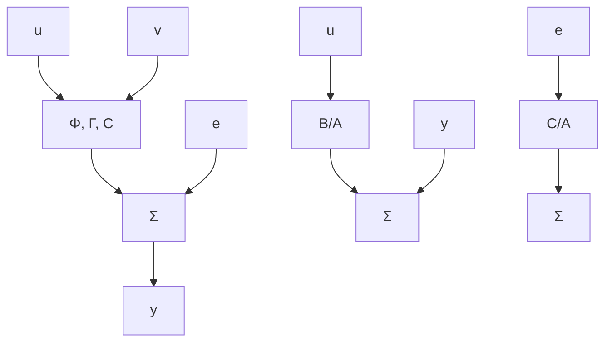

# Disturbances

Assume that the influence of the environment on the process can be characterized by disturbances that are stochastic processes. Because the system is linear, the principle of superposition can be used to reduce all disturbances to an equivalent disturbance v at the system output. The output of the system is thus given by

$$y (k) = x (k) + v (k) \tag {12.2}$$

Further assume that the disturbance v may be represented as the output of a linear system driven by white noise—that is,

$$v (k) = \frac {C _ {1} (q)}{A _ {2} (q)} e (k) \tag {12.3}$$

where $C_{1}(q)$ and $A_{2}(q)$ are polynomials in the forward-shift operator, and $e(k)$ is a sequence of independent or uncorrelated random variables with zero mean and standard deviation $\sigma$ . The disturbance v may be a stationary random process. It may, however, also be drifting, because the polynomial $A_{2}(q)$ may be unstable. The model of the process and its environment can be reduced to a standard form. Eliminate v and x among (12.1), (12.2), and (12.3), and introduce

$$
\begin{array}{l} A = A _ {1} A _ {2} \\ B = B _ {1} A _ {2} \tag {12.4} \\ C = C _ {1} A _ {1} \\ \end{array}
$$

flowchart

Figure 12.1 Representation of a system with one input and stochastic disturbances using one or two noise sources.

The following model is then obtained.

$$A (q) y (k) = B (q) u (k) + C (q) e (k) \tag {12.5}$$

This is the canonical model, which will be the basis of the control design. In the special case when there are no disturbances, the model is simply a rational pulse-transfer function (see Sec. 2.6). When there is no control signal, the model is a stochastic process with a rational spectral density or an ARMA process (see Sec. 10.4). The model (12.5) is a convenient canonical representation of a linear system perturbed by noise. In Chapter 11 the process was driven by two noise sources. By using the spectral-factorization theorem (Theorem 10.3) the noise can be reduced to one source. Compare Fig. 12.1.
