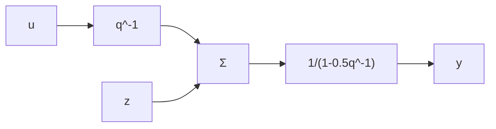

# 12.8 Problems

12.1 Consider the process

$$y (k) = 2 \frac {q ^ {2} - 1 . 4 q + 0 . 5}{q ^ {2} - 1 . 2 q + 0 . 4} e (k)$$

where $e(k)$ is white noise with zero mean and unit variance. Determine the optimal m-step-ahead predictor and the variance of the prediction error when m = 1, 2, and 3.

12.2 Determine the m-step-ahead predictor for the process

$$y (k) + a y (k - 1) = e (k) + c e (k - 1)$$

Determine also the variance of the prediction error as a function of m.

12.3 A stochastic process is described by

$$y (k) - 0. 9 y (k - 1) = e (k) + 5 e (k - 1)$$

(a) Determine an equivalent description such that the zero of a corresponding polynomial $C$ is inside the unit circle. How large is the variance of $y$ ?   
(b) Determine the two-step-ahead predictor for the process and the variance of the prediction error.

12.4 Assume that the demand for a product in an inventory, $z(k)$ , can be described as

$$z (k) = 3 0 0 + 1 0 k + y (k)$$

where the time unit is months, and $y(k)$ is described by the process

$$y (k) - 0. 7 y (k - 1) - 0. 1 y (k - 2) = 6 e (k)$$

where $e(k)$ is white noise with zero mean and unit variance. Make a prediction and determine the expected standard deviation of the prediction error for August through November when the following data are available:

<table><tr><td>Month</td><td>k</td><td>z(k)</td></tr><tr><td>January</td><td>1</td><td>320</td></tr><tr><td>February</td><td>2</td><td>320</td></tr><tr><td>March</td><td>3</td><td>325</td></tr><tr><td>April</td><td>4</td><td>330</td></tr><tr><td>May</td><td>5</td><td>350</td></tr><tr><td>June</td><td>6</td><td>370</td></tr><tr><td>July</td><td>7</td><td>375</td></tr></table>

flowchart

Figure 12.11

12.5 Consider the process

$$
\begin{array}{l} y (k) - y (k - 1) + 0. 5 y (k - 2) = u (k - 2) + 0. 5 u (k - 3) \\ + 0. 5 \left(e (k) + 0. 8 e (k - 1) + 0. 2 5 e (k - 2)\right) \\ \end{array}
$$

Determine the minimum-variance controller and the minimum achievable variance.

12.6 Determine the minimum-variance controller for the system

$$y (k) - 0. 5 y (k - 1) = u (k - 2) + e (k) - 0. 7 e (k - 1)$$

where $e(k)$ is white noise with mean 2 and unit variance.

12.7 Consider the process

$$y (k) + a y (k - 1) = u (k - 2) + e (k) + c e (k - 1)$$
