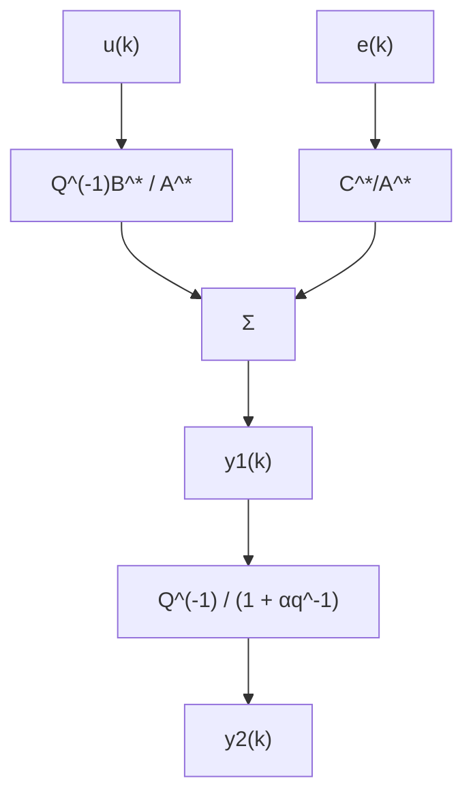

where $e(k)$ is white noise and B is stable. The polynomials A, C, and D are assumed to be monic. Determine the minimum-variance controller for the system.

12.13 Use the result from Problem 12.12 to determine the minimum-variance controller for the system

$$y (k) = \frac {b q ^ {- 1}}{1 + a q ^ {- 1}} u (k) + (1 + c q ^ {- 1}) e (k)$$

flowchart

Figure 12.12

12.14 Consider the process in Problem 12.13. Assume that the sampling period is doubled; that is, the control signal can be changed only at every second time unit. Determine the minimum-variance controller and compare with the case when the control period is one time unit.

12.15 Consider the system in Fig. 12.12, where e is white noise with zero mean and unit variance. Further,

$$A (q) = q - 0. 7 \quad B (q) = qC (q) = 1 - 0. 5 q \quad \alpha = - 0. 8$$

(a) Determine a controller that minimizes the variance of $y_{1}$ .   
(b) Determine the variances of $y_{1}$ and $y_{2}$ when the controller in (a) is used.   
(c) Determine a controller that minimizes the variance of $y_{2}$ if only $y_{2}$ is measurable, and compute the variances of $y_{1}$ and $y_{2}$ .   
(d) Determine a controller that minimizes the variance of $y_{2}$ if both $y_{1}$ and $y_{2}$ are measurable.   
(e) What are the variances of $y_{1}$ and $y_{2}$ when the controller in (d) is used?

12.16 Given the process

$$A (q) y (k) = B (q) u (k) + C (q) e (k) + D (q) v (k)$$

where $v(k)$ is a known disturbance. Determine the minimum-variance controller for the process when $\deg D = \deg B$ .

12.17 Determine the LQG-controller given by Theorem 12.4 for the process

$$(1 - 0. 9 q ^ {- 1}) y (k) = u (k - 1) + (1 - 0. 5 q ^ {- 1}) e (k)$$

when $\rho = 1$ . Calculate the variance of the output and the input for different values of $\rho$ .

12.18 Consider a system with stable inverse. Derive the minimum-variance controller, where the control signal $u(k)$ is allowed to be a function of $y(k - 1), y(k - 2), \ldots, u(k - 1), \ldots$ . Derive the characteristic equation of the closed-loop system.

12.19 Show that the pulse-transfer function from $e$ to $y$ for (12.5) and (12.55) is given by (12.56). Use (12.45) to derive the minimum-variance controller for a system where
