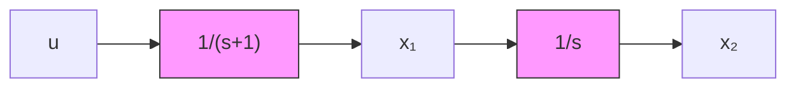

# Example A.2 Motor

A DC motor can be described by a second-order model with one integrator and one time constant (see Fig. A.2). The input is the voltage to the motor and the output is the shaft position. The time constant is due to the mechanical parts of the system, and the dynamics due to the electrical parts are neglected. A normalized model of the process is then given by

$$Y (s) = \frac {1}{s (s + 1)} U (s)$$

Introduce the velocity and the position of the motor shaft as states (see Fig. A.2). The state-space model of the motor is then given by

$$
\frac {d x}{d t} = \left( \begin{array}{c c} - 1 & 0 \\ 1 & 0 \end{array} \right) x + \binom {1} {0} u \tag {A.5}

y = \left( \begin{array}{c c} 0 & 1 \end{array} \right) x
$$

flowchart

Figure A.2 Normalized model of a DC motor.

text_image

u
y
l
m

Figure A.3 Pendulum.

Sampling (A.5) using a zero-order hold gives the discrete-time model

$$
x (k h + h) = \left( \begin{array}{c c} e ^ {- h} & 0 \\ \mathbf {1} - e ^ {- h} & \mathbf {1} \end{array} \right) x (k h) + \binom {\mathbf {1} - e ^ {- h}} {h - \mathbf {1} + e ^ {- h}} u (k h) \tag {A.6}

y (k h) = \left( \begin{array}{c c} 0 & 1 \end{array} \right) x (k h)
$$

(see Example 2.3). A current-controlled DC motor with the shaft velocity as output can also be described by the model of (A.5). Still another example that can be characterized by an integrator and a single pole is a ship. Let the input be the rudder angle and the output be the heading. The ship can then be described by the transfer function

$$G (s) = \frac {K}{s (1 + T s)}$$

where the time constant may be positive or negative depending on the type of ship. For instance, large tankers are unstable.
