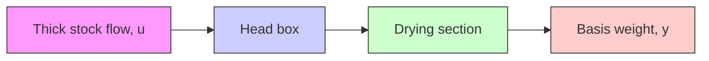

# Example A.3 Harmonic oscillator

Consider a pendulum (see Fig. A.3). The acceleration of the pivot point is the input and the angle y is the output. The system is then described by the normalized nonlinear equations

$$\frac {d x _ {1}}{d t} = x _ {2}\frac {d x _ {2}}{d t} = \sin x _ {1} + u \cos x _ {1}\mathbf {y} = \mathbf {x} _ {1}$$

where $x_{1}$ is the angle and $x_{2}$ is the angular velocity. Linearizing around $u = x_{1} = 0$ gives

$$
\frac {d x}{d t} = \left( \begin{array}{l l} 0 & 1 \\ - 1 & 0 \end{array} \right) x + \binom {0} {1} u \tag {A.7}

y = \left( \begin{array}{l l} 1 & 0 \end{array} \right) x
$$

flowchart

Figure A.4 Schematic diagram of a paper machine.

The transfer function of (A.7) is given by

$$G (s) = \frac {1}{s ^ {2} + 1}$$

This transfer function can be generalized to

$$G (s) = \frac {\omega^ {2}}{s ^ {2} + \omega^ {2}}$$

One state-space representation for this transfer function is

$$
\frac {d x}{d t} = \left( \begin{array}{c c} 0 & \omega \\ - \omega & 0 \end{array} \right) x + \binom{0}{\omega} u \tag {A.8}

y = \left( \begin{array}{c c} 0 & 1 \end{array} \right) x (t)
$$

Sampling (A.8) using a zero-order hold gives the discrete-time system

$$
x (k h + h) = \left( \begin{array}{c c} \cos \omega h & \sin \omega h \\ - \sin \omega h & \cos \omega h \end{array} \right) x (k h) + \binom {1 - \cos \omega h} {\sin \omega h} u (k h) \tag {A.9}

y (k h) = \left( \begin{array}{c c} 1 & 0 \end{array} \right) x (k h)
$$

An overhead crane can also be modeled by (A.8).
