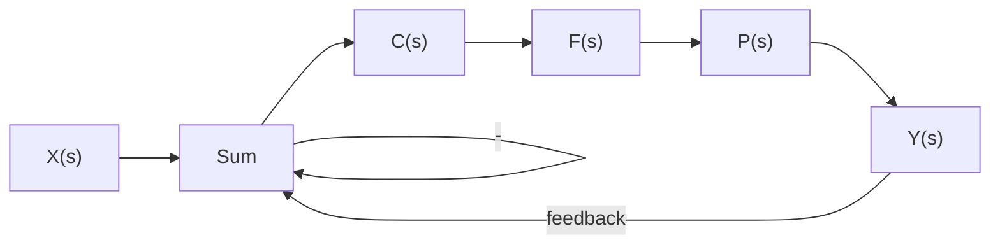

# Example 11.1

A system is expected to have a bandwidth of 10Hz but we want to be very safe. What sampling rate should we use?

Solution 1: With no safety margin, we would sample at $f _ { N } = 2 \times 1 0 H z = 2 0 H z$ . We learn from the Boss that standard practices in our industry dictate that we will have a safety factor of 10. Thus we will sample at

$$f _ {s a m p} = 1 0 \times f _ {N} = 2 0 0 H z$$

A second rule of thumb is to specify a maximum gain magnitude that the system can have to dene its bandwidth more precisely. Then we double that to nd the Nyquist rate.

flowchart

Figure 11.2: Closed loop continuous time control system. Assume that we have designed a transfer function C(s) which gives us a satisfactory system response.
