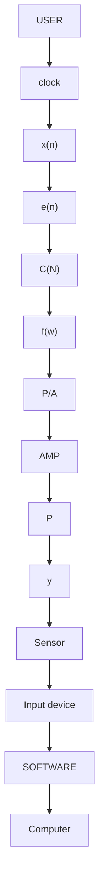

# 11.4 Digital Control Systems

Let's put these ideas to work on a control system such as that of Figure 11.2. We want to implement the control system in a computer. The plant, P (s), of course stays outside the computer system since it is NOT a simulation. A control system implemented by computer would thus look like the parts of Figure 11.3 which are inside the box. Refering to Figure 11.3, an input x(n) is provided, for example from a user interface. The actual system output is sensed by a sensor and sampled (measured at regular points in time) by an input device, and error, e(n), is computed in the computer. The controller C(n) is a digital lter creating the force output, f(n), which is applied to the plant by a digital-to-analog converter plus amplier.

flowchart

Figure 11.3: Closed loop control system using a computer, a digital-to-analog $( \mathrm { D / A } )$ converter, an amplier (AMP) to increase power output to the plant (P) and a sensor for feedback to the controller. C refers to a discrete time implementation, $C ( n )$ of $C ( t )$ .
