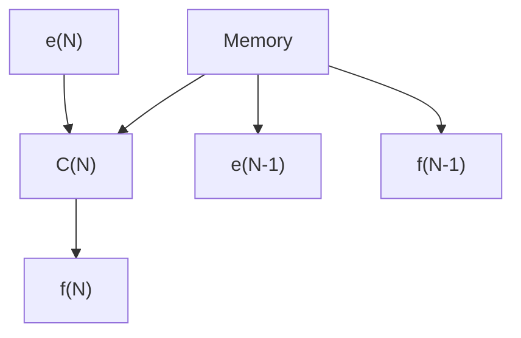

# 11.6 Code Example

Let's put this equation into some computer code. We will not worry about many details such as the operating system or exact computer syntax, and we will assume that functions are available to do the I/O for us.

The code runs (Listing 11.2) in an innite loop (line 10) and executes the controller over and over. First, we note the current time and store it in t. We get the controller input, for example from a user interface or a trajectory generator, in line 12. Then we read a sensor to measure the actual output ys (line 13). After


<details>
<summary>flowchart</summary>


</details>

Figure 11.5: A way to implement the example digital controller. The memory stores previous values for e(n), f (n).

```txt
/* EE447, U. of Washington. Example of basic digital control code */
double e, x, f; // define our system loop variables
double ys; // this will be our sensed y for feedback
double en1, fn1; // these will be e(n-1) etc.
int T=1000; // sampling time in milli seconds.
int t, t1; // variables for keeping track of time.
en1 = fn1 = 0.0; // we have to start them with something!
// loop forever
while(1) {
    t = get_current_time();
    x = get_command_input(); // get our input from somewhere
    ys = read_sensor(); // get feedback from our system
    en = x-ys; // compute error (H=1)
    f = 4.1667 * (en+en1) - 0.6667*fn1; // compute controller output
    output_to_plant(f); // send controller output to plant
    en1 = en; // store previous values of e, f
    fn1 = f;
    t1 = get_current_time();
    wait(T-(t-t1)); // wait for next sample time
} 
```

Listing 11.2. Example of a pseudocode application which implements a discrete time controller.

we compute the error, we are ready to compute the controller output (line 16) using the equation we derived above. Note that the coecients in line 16 are specic to $T = 1 . 0$ and will be wrong if we arbitrarily change T in the code. After we put the controller output out to the plant (line 18) we store the current values of $\in ,$ f in the previous values for use in the next cycle. Finally, we gure out how much time has elapsed between lines 11 and 23, and use that to derive the correct argument for a wait(t) function so that our timing is accurate.
