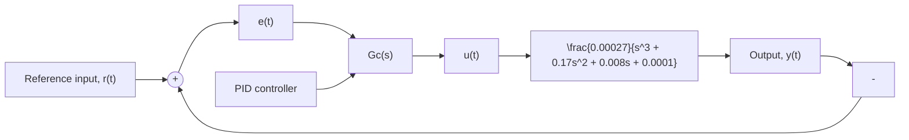
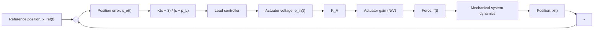

# 10.17 Figure P10.17 shows a closed-loop system with a PID controller.

flowchart

Figure P10.17

a. Use the Ziegler–Nichols reaction-curve method to select the PID control gains. Use MATLAB and Simulink as needed.   
b. Use Simulink to simulate the closed-loop response to a unit-step input, $r ( t ) = U ( t )$ , with the PID controller obtained in part (a). Plot y(t).   
c. Use the Simulink model from part (b) and vary the PID gains in an attempt to decrease the overshoot while maintaining a fast closed-loop response (use the Ziegler–Nichols gains from part (a) as the starting point). Plot the closed-loop response y(t) for an improved PID control scheme along with the output y(t) obtained in part (b) using the Ziegler–Nichols gains.

10.18 Repeat all parts of Problem 10.17 using the Ziegler–Nichols ultimate-gain method to design the PID controller.

10.19 Figure P10.19 shows the mechanical position-control system from Examples 10.6, 10.8, 10.12, and 10.13. The open-loop pole of the lead controller is $p _ { L }$ . The actuator gain is $K _ { A } = 2 \mathrm { N } / \mathrm { V } .$ .

flowchart

Figure P10.19

a. Use MATLAB to create the root-locus plots for four different lead controllers: $p _ { L } = 4 , 1 5 , 2 5 .$ , and 30.   
b. Interpret the four root-locus plots (and their corresponding closed-loop responses) for these four lead controllers. Compare these four root-locus plots to the results from Example 10.12 (PD controller) and Example 10.13 (lead controller). What conclusions can you draw regarding the open-loop pole location of the lead controller?
