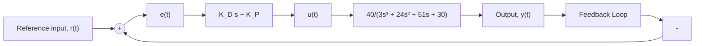

10.20 Consider again the simple unity-feedback control system shown in Fig. P10.3. The plant transfer function is

$$G _ {P} (s) = \frac {0 . 3}{0 . 0 4 s ^ {4} + 0 . 1 2 s ^ {3} + 1 . 0 8 s ^ {2} + s}$$

The controller is a simple gain adjustment $K _ { P }$ . Determine the control gain $K _ { P }$ so that the phase margin is $\phi _ { \mathrm { p m } } = 5 0 ^ { \circ }$ .

10.21 A simple closed-loop system is shown in Fig. P10.21.

flowchart

Figure P10.21

a. Use MATLAB and the Bode diagram to determine the gain and phase margins for a P-controller with $K _ { P } = 2 . 5$ and $K _ { D } = 0$ .   
b. Use MATLAB and the Bode diagram to determine the gain and phase margins for a PD controller with $K _ { P } = 2 . 5$ and $K _ { D } = 1 . 5$ .   
c. Use MATLAB to plot the root locus for the P-controller in part (a) and the PD controller in part (b). Use the PD controller form $G _ { C } ( s ) = K ( s + 1 . 6 6 7 )$ so that the controller zero location matches the PD gains in part (b). On the basis of the results from parts (a)–(c), comment on how the PD controller changes the closed-loop response characteristics compared to a P-controller.

10.22 For the unity-feedback control system shown in Fig. P10.22, design a lead controller so that the compensated closed-loop system meets the following performance criteria: (1) phase margin is at least $5 0 ^ { \circ }$ , (2) gain margin is at least 12 dB, and (3) steady-state tracking error is less than 0.2 for a ramp input $r ( t ) = 0 . 5 t$ . Support your lead-controller design with the appropriate graphical analyses using MATLAB [Hint: first compute the static velocity error constant that is required for the steady-state tracking error constraint; next, compute the stability margins using only gain adjustment K; finally, design the lead controller to meet the stability margins].

flowchart

