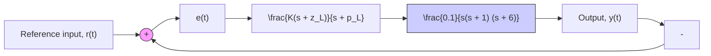

Figure P10.22

10.23 Figure P10.23 shows the Bode diagram of an open-loop transfer function G(s)H(s) that is part of a closedloop control system. The open-loop transfer function contains a lead controller with a control gain setting of K = 2, which corresponds to the Bode diagram in Fig. P10.23. Estimate the gain and phase margins and the control gain $K _ { \mathrm { m s } }$ that drives the closed-loop system to the point of marginal stability.

line

| Frequency, ω, rad/s | Magnitude, dB |
| --- | --- |
| 0.1 | 20 |
| 1 | 0 |
| 10 | -60 |

line

| Frequency, ω, rad/s | Phase, deg |
| --- | --- |
| 0.1 | -90 |
| 1 | -180 |
| 10 | -270 |

Figure P10.23
