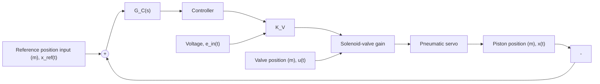
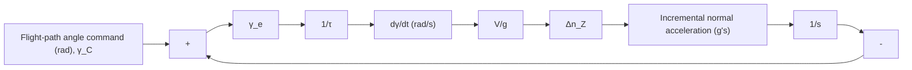

Figure P10.24

10.25 A simplified version of the Space Shuttle’s Flare and Shallow Glide Slope normal acceleration command channel is shown in Fig. P10.25. The input is a flight-path angle command, $\gamma _ { C }$ (in rad), and the output is an incremental normal acceleration command, $\Delta n _ { Z }$ (in units of $^ { \ast } g ^ { \prime \prime } )$ . Note that dividing the flight-path angle error $\gamma _ { e }$ by time constant ?? produces the approximate angular rate d??/dt, which is then multiplied by velocity V to produce normal acceleration. Earth gravity acceleration is $\dot { g } = 3 2 . 2 \mathrm { f t } / \mathrm { s } ^ { 2 }$ , and the Shuttle’s velocity is V = 420 ft/s during the Flare and Shallow Glide Slope phase.

flowchart

Figure P10.25

Use Simulink to simulate the closed-loop response to a step-input flight-path angle command $\gamma _ { C } ( t ) =$ 0.09U(t) rad. Adjust the time constant ?? so that the incremental normal acceleration $\Delta n _ { Z } ( t )$ shows a peak value equal to 0.4 g. Plot $\Delta n _ { Z } ( t )$ for the best design value for ?? and describe the closed-loop response for the incremental normal acceleration. Relate the time constant ?? to the settling time.
