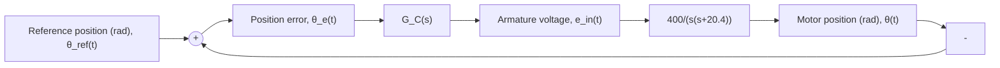

10.26 Figure P10.26 shows the angular position control of a DC motor. The DC motor parameters are taken from Example 10.3 (inductance is neglected). Design a lead controller $G _ { C } ( s )$ for the closed-loop motor position control that meets the following criteria: (1) the steady-state error for a reference input $\theta _ { \mathrm { r e f } } ( t ) = 2 0 t$ rad is less than 0.1 rad, and (2) the phase margin is greater than $4 5 ^ { \circ }$ . Use Simulink to obtain the closed-loop response for the controller design and plot $\theta _ { \mathrm { r e f } } ( t )$ and $\theta ( t )$ on the same figure, and plot armature voltage $e _ { \mathrm { i n } } ( t )$ .

flowchart

Figure P10.26
