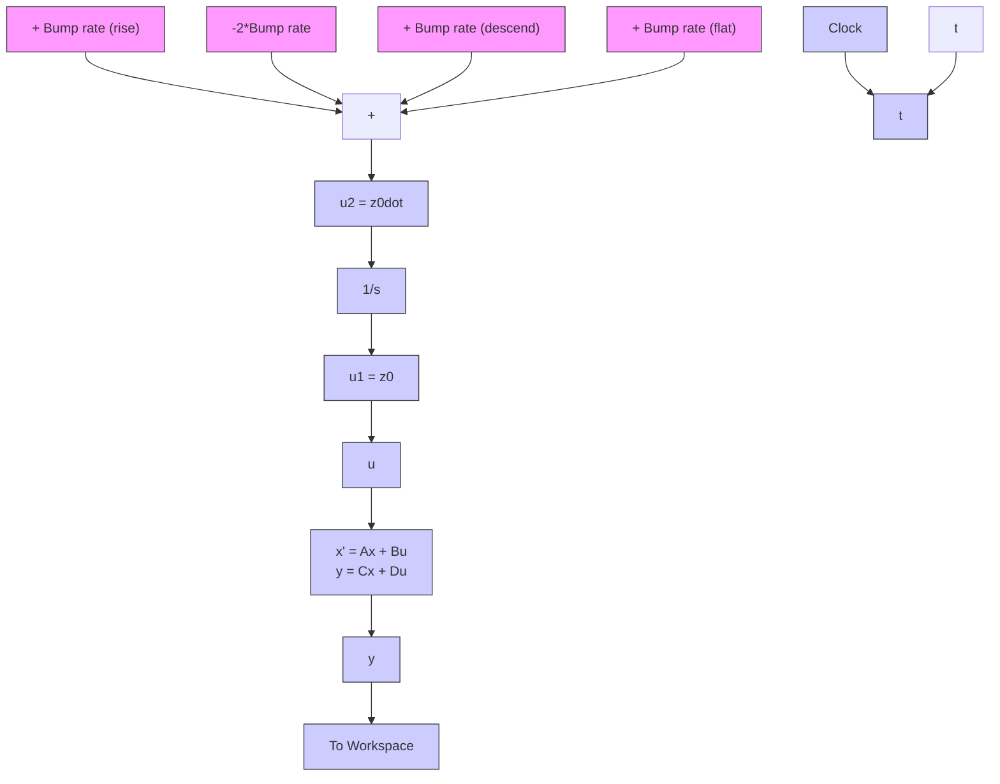

Figure 11.2 Simulink diagram for the seat-suspension system: triangular pulse input.

line

| Time, s | Velocity input, u₂(t), m/s |
| --- | --- |
| 0.4 | 0 |
| 0.5 | 5 |
| 0.52 | -5 |
| 0.6 | 0 |

(a)

line

| Time, s | Floor input, u₁(t), m |
| --- | --- |
| 0.4 | 0.0 |
| 0.5 | 0.03 |
| 0.6 | 0.0 |

(b)

Figure 11.3 Seat-suspension system inputs: (a) velocity-pulse input $u _ { 2 } ( t )$ and (b) triangular-pulse input $u _ { 1 } ( t )$ .   

line

| Time, s | Driver-mass displacement, z₂(t), mm |
| --- | --- |
| 0.5 | 0.0 |
| 0.6 | 1.5 |
| 0.8 | -0.7 |
| 1.0 | 0.2 |
| 1.5 | -0.1 |
| 2.0 | 0.0 |
| 3.0 | 0.0 |

(a)

line

| Time, s | Driver acceleration, m/s² |
| --- | --- |
| 0.5 | 6.2 |
| 1.0 | 0.0 |
| 1.5 | 0.0 |
| 2.0 | 0.0 |
| 2.5 | 0.0 |
| 3.0 | 0.0 |

Figure 11.4 Impulse response of the seat-suspension system: (a) driver displacement and (b) driver acceleration.

damping ratio of the seat-suspension system. The first peak is 1.52 mm $( \mathrm { a t } t = 0 . 1 1 \mathrm { s }$ after the impulse), and the second peak value is 0.19 mm $( \mathrm { a t } t = 0 . 7 0 \mathrm { s }$ after the impulse). Therefore, the log decrement is

$$\delta = \ln {\frac {1 . 5 2}{0 . 1 9}} = 2. 0 6 9 4$$

The approximate damping ratio is
