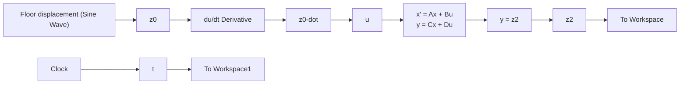

Figure 11.5 Simulink diagram for the seat-suspension system: sinusoidal input.

line

| Time, s | Driver, z₂(t) | Floor, z₀(t) |
| --- | --- | --- |
| 0 | 0 | 0 |
| 1 | 20 | 20 |
| 2 | 0 | 0 |
| 3 | -20 | -20 |
| 4 | 0 | 0 |
| 5 | 20 | 20 |
| 6 | 0 | 0 |
| 7 | -20 | -20 |
| 8 | 0 | 0 |

(a)

line

| Time, s | Driver, z₂(t) | Floor, z₀(t) |
| --- | --- | --- |
| 0.0 | 0 | 0 |
| 0.5 | 28 | 20 |
| 1.0 | -30 | -20 |
| 1.5 | 30 | 20 |
| 2.0 | -30 | -20 |
| 2.5 | 30 | 20 |

line

| Time, s | Driver, z₂(t) (mm) | Floor, z₀(t) (mm) |
| --- | --- | --- |
| 0.0 | 0 | 0 |
| 0.1 | 10 | 20 |
| 0.2 | 0 | -20 |
| 0.3 | -10 | 20 |
| 0.4 | 0 | -20 |
| 0.5 | 10 | 20 |
| 0.6 | 0 | -20 |
| 0.7 | -10 | 20 |
| 0.8 | 0 | -20 |
| 0.9 | 10 | 20 |
| 1.0 | 0 | -20 |
| 1.1 | -10 | 20 |
| 1.2 | 0 | -20 |
| 1.3 | 10 | 20 |
| 1.4 | 0 | -20 |
| 1.5 | 0 | 0 |

(c)   
Figure 11.6 Frequency response of driver-mass displacement $z _ { 2 } .$ (a) input frequency = 0.25 Hz, (b) input frequency = 1Hz, and (c) input frequency = 4Hz.

Figure 11.7 shows the frequency response for driver acceleration along with the input floor acceleration $\ddot { z } _ { 0 } ( t )$ for an input frequency of 1 Hz. Because floor displacement is $z _ { 0 } ( t ) = a$ sin ??t, floor velocity and acceleration are $\dot { z } _ { 0 } ( t ) = \omega a \cos \omega t$ and $\ddot { z } _ { 0 } ( t ) = - \omega ^ { 2 } a$ sin ??t, respectively. The magnitude of the floor acceleration is $\omega ^ { 2 } a ,$ , or $0 . 7 9 \mathrm { m } / \mathrm { s } ^ { 2 }$ when $a = 0 . 0 2$ m and $\omega = 6 . 2 8 \mathrm { r a d / s }$ . The amplitude ratio of output (driver) and floor (input) acceleration is $1 . 2 1 / 0 . 7 9 = 1 . 5 3$ , which is nearly the same as the amplitude ratio of the driver/floor displacements shown in Fig. 11.6b for the same 1-Hz input frequency. The steady-state phase lag between the driver and floor accelerations shown in Fig. 11.7 is nearly the same as the phase lag in Fig. 11.6b.
