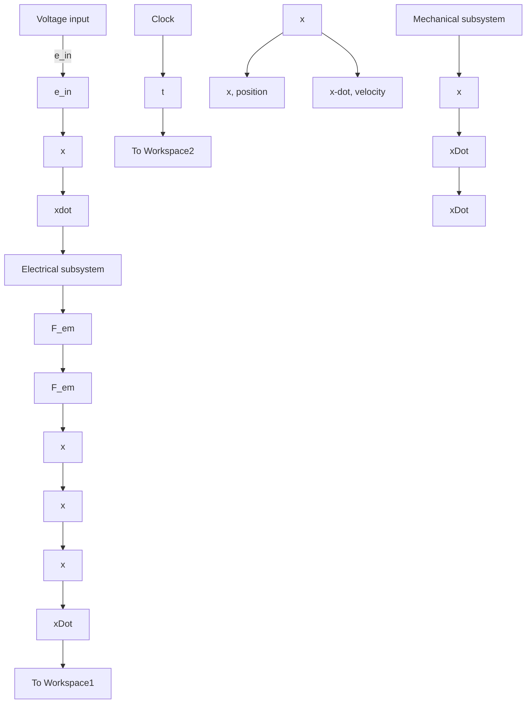

# Simulink Model

Figure 11.14 shows the Simulink model of the integrated solenoid actuator, which is a modified version of the solenoid model developed for Example 6.9. Figure 11.14 is slightly different from Fig. 6.28 as the armature position from the mechanical subsystem is fed back as an input to the electrical subsystem because inductance $L ( x )$ increases with x. Figure 11.15 shows the inner details of the electrical subsystem. The reader should be able to identify the back emf and electromagnetic force computations, Eqs. (11.13) and (11.15), in Fig. 11.15, as well as the summation of all voltage terms that appear in Eq. (11.9). A user-defined function Fcn divides the net voltage (from the summing junction) by the inductance $L ( x )$ in order to determine the time rate of current, ̇I. Note that inductance is simply $L ( x ) = L _ { 0 } + K x$ as we assumed that $K = d L / d x$ is constant.

flowchart

Figure 11.14 Simulink diagram for the solenoid actuator.

```mermaid
graph TD
    A["Input voltage, e_in"] --> B["+"]
    C["Position, x"] --> D["x"]
    E["Position, x"] --> F["e_R"]
    G["Position, x"] --> H["R"]
    I["Position, x"] --> J["Resistance"]
    K["Position, x"] --> L["e_b"]
    M["Position, x"] --> N["K"]
    O["Position, x"] --> P["X"]
    Q["Position, x"] --> R["Product"]
    S["Position, x"] --> T["Back-emf constant dL/dx"]
    U["Input voltage, e_in"] --> V["+"]
    W["Net voltage"] --> X["u(1)/(L0 + K*u(2))"]
    X --> Y["I-dot"]
    Z["1/s"] --> AA["1/s"]
    AB["Current"] --> AC["u²"]
    AD["Math Function"] --> AE["0.5*K"]
    AF["Force constant 0.5 dL/dx"] --> AG["1"]
    AH["To Workspace"] --> AI["I"]
    AJ["Velocity, x-dot"] --> AK["3"]
    AL["xdot"] --> AM["Velocity, x-dot"]
```

flowchart

Figure 11.15 Simulink diagram for the solenoid: electrical subsystem.
