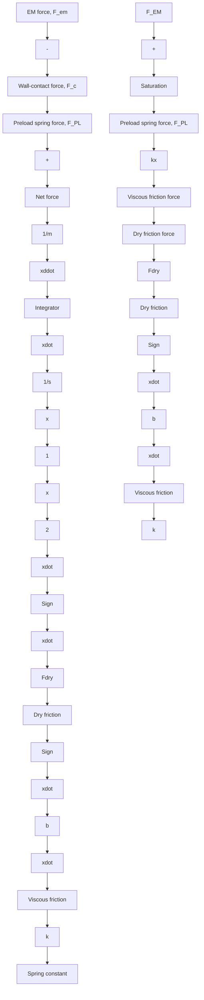

```mermaid
graph TD
    A["EM force, F_em"] --> B["-"]
    B --> C["Wall-contact force, F_c"]
    C --> D["Preload spring force, F_PL"]
    D --> E["+"]
    E --> F["Net force"]
    F --> G["1/m"]
    G --> H["xddot"]
    H --> I["Integrator"]
    I --> J["xdot"]
    J --> K["1/s"]
    K --> L["x"]
    L --> M["1"]
    M --> N["x"]
    N --> O["2"]
    O --> P["xdot"]
    P --> Q["Sign"]
    Q --> R["xdot"]
    R --> S["Fdry"]
    S --> T["Dry friction"]
    T --> U["Sign"]
    U --> V["xdot"]
    V --> W["b"]
    W --> X["xdot"]
    X --> Y["Viscous friction"]
    Y --> Z["k"]
    Z --> AA["Spring constant"]
    AB["F_EM"] --> AC["+"]
    AC --> AD["Saturation"]
    AD --> AE["Preload spring force, F_PL"]
    AE --> AF["kx"]
    AF --> AG["Viscous friction force"]
    AG --> AH["Dry friction force"]
    AH --> AI["Fdry"]
    AI --> AJ["Dry friction"]
    AJ --> AK["Sign"]
    AK --> AL["xdot"]
    AL --> AM["b"]
    AM --> AN["xdot"]
    AN --> AO["Viscous friction"]
    AO --> AP["k"]
```

Figure 11.16 Simulink diagram for the solenoid: mechanical subsystem.
