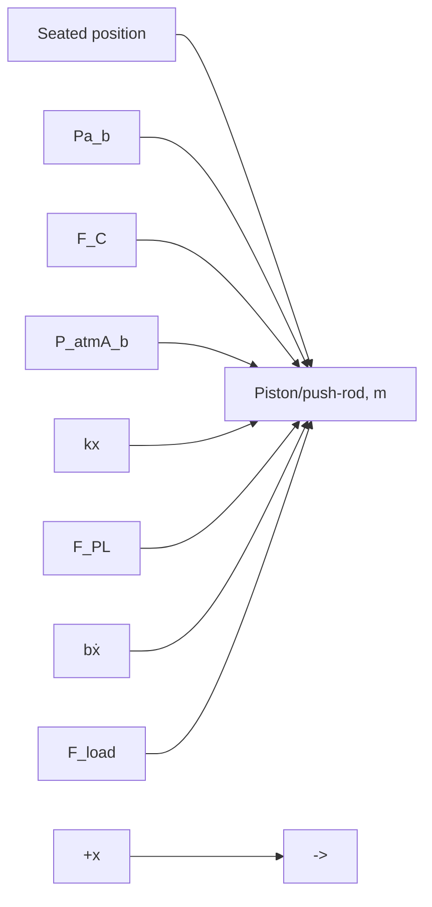

# Mathematical Model

The complete mathematical model consists of the pneumatic and mechanical subsystems. Figure 11.23 shows a free-body diagram of the mechanical subsystem, consisting of the piston/push-rod mass m. Piston displacement x is positive to the right, and the seat of the diaphragm constrains x to positive displacements only. The forces acting on mass m include the air-pressure forces, the seat contact force, the spring force (including the preload), the viscous friction force, and the reactive load force due to a spring in the S-cam mechanism. Applying Newton’s second law with a positive sign convention to the right yields

$$+ \rightarrow \sum F = P A _ {b} + F _ {C} - P _ {\mathrm{atm}} A _ {b} - k x - F _ {\mathrm{PL}} - b \dot {x} - F _ {\text {load}} = m \ddot {x} \tag {11.23}$$

where P is the air pressure in the brake chamber, $A _ { b }$ is the area of the diaphragm-piston, $P _ { \mathrm { a t m } }$ is atmospheric pressure, $F _ { C }$ is the contact force with the seat, k is the return spring constant, b is the viscous friction coefficient, $F _ { \mathrm { P L } }$ is the preload spring force, and $F _ { \mathrm { l o a d } }$ is the load force from actuating the S-cam in the brake drum. Rearranging Eq. (11.23) so that all terms involving displacement x are on the left-hand side yields

$$m \ddot {x} + b \dot {x} + k x = (P - P _ {\mathrm{atm}}) A _ {b} + F _ {C} - F _ {\mathrm{PL}} - F _ {\text { load }} \tag {11.24}$$

flowchart

Figure 11.23 Free-body diagram of the mechanical subsystem.

As with the solenoid actuator, the contact force only exists when the preload spring force exceeds the differential pressure force and the piston is seated with $x = 0$

$$
F _ {C} = \left\{ \begin{array}{c c l} F _ {\mathrm{PL}} - (P - P _ {\mathrm{atm}}) A _ {b} & \text { if } & (P - P _ {\mathrm{atm}}) A _ {b} <   F _ {\mathrm{PL}} \text {   and   } x = 0 \\ 0 & \text { if } & (P - P _ {\mathrm{atm}}) A _ {b} \geq F _ {\mathrm{PL}} \text {   or   } x > 0 \end{array} \right. \tag {11.25}
$$
