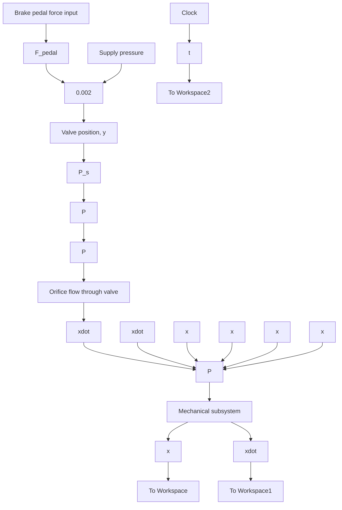
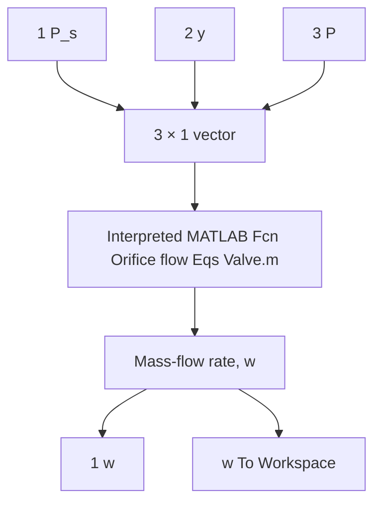

```mermaid
graph TD
    A["Brake pedal force input"] --> B["F_pedal"]
    B --> C["0.002"]
    C --> D["Valve position, y"]
    D --> E["P_s"]
    E --> F["P"]
    F --> G["P"]
    G --> H["Orifice flow through valve"]
    H --> I["xdot"]
    I --> J["P"]
    J --> K["Mechanical subsystem"]
    K --> L["x"]
    L --> M["To Workspace"]
    K --> N["xdot"]
    N --> O["To Workspace1"]
    P["Clock"] --> Q["t"]
    Q --> R["To Workspace2"]
    S["Supply pressure"] --> C
    T["xdot"] --> J
    U["x"] --> J
    V["x"] --> J
    W["x"] --> J
    X["x"] --> J
```

Figure 11.25 Simulink diagram for the pneumatic air-brake system.

flowchart

```mermaid
graph TD
    A["1 P_s"] --> C["3 × 1 vector"]
    B["2 y"] --> C
    D["3 P"] --> C
    C --> E["Interpreted MATLAB Fcn Orifice flow Eqs Valve.m"]
    E --> F["Mass-flow rate, w"]
    F --> G["1 w"]
    F --> H["w To Workspace"]
```

Figure 11.26 Orifice-flow subsystem for the pneumatic air brake.
