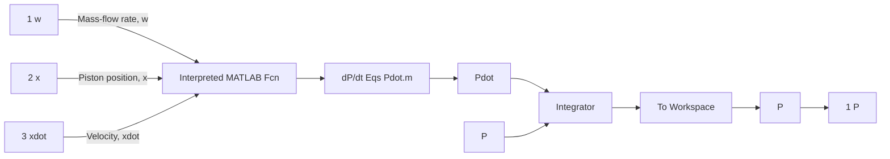

MATLAB M-file 11.2   
```matlab
% Valve.m
%
% This M-file models the mass-flow rate of air in/out
% of the brake chamber. Assumes flow through the
% valve is air flow through a sharp-edged orifice.
%
% Inputs: u (3x1 vector) = [P_s y P ]'
%
%
%
%
%
Output: w = in/out mass-flow rate, kg/s
%
function w = Valve(u)
% system parameter
h = 2e-3;    % height of valve opening, m
% pneumatic constants (air)
gamma = 1.4;    % = cp/cv = ratio of specific heats
Cd = 0.8;    % discharge coefficient
R = 287;    % gas constant (air), N-m/kg-K
T = 298;    % temperature, K
P_atm = 1.0133e5;    % ambient (atmospheric) pressure, Pa
% System inputs
P_s = u(1);    % supply pressure, Pa
y = u(2);    % valve displacement, m
P = u(3);    % pressure in brake chamber, Pa
% Compute valve orifice area
Av = abs(y)*h;    % valve orifice area, m^2
% Determine if flow is from supply tank (y > 0), or if flow
% is out to atmospheric (ambient) pressure (y < 0)
if y >= 0
    Pv = P_s;    % use supply pressure
else
    Pv = P_atm;    % use atmospheric pressure
end
% find up/down stream pressure
P_hi = max(P,Pv);    % highest pressure (upstream)
P_lo = min(P,Pv);    % lowest pressure (downstream)
% critical pressure ratio (for choked flow)
Cr = (2/(gamma+1))^ (gamma/(gamma-1));    % = 0.528 for air
% Determine whether or not flow is choked (sonic at throat)
PR = P_lo/P_hi;    % pressure ratio downstream/upstream of orifice
% mass-flow rate equations for compressible flow, kg/s
if PR > Cr
    % flow is not choked
    w = sign(Pv-P)*Cd*Av*P_hi*sqrt(((2*gamma/(gamma-1))/(R*T))*(PR^(2/gamma)...
    - PR^(gamma+1)/gamma)));
else
    % flow is choked (Mach=1 at throat)
    w = sign(Pv-P)*Cd*Av*P_hi*sqrt((gamma/(R*T))*Cr^(gamma+1)/gamma));
end 
```


<details>
<summary>flowchart</summary>


</details>

Figure 11.27 Brake chamber pressure subsystem for the pneumatic air brake.
